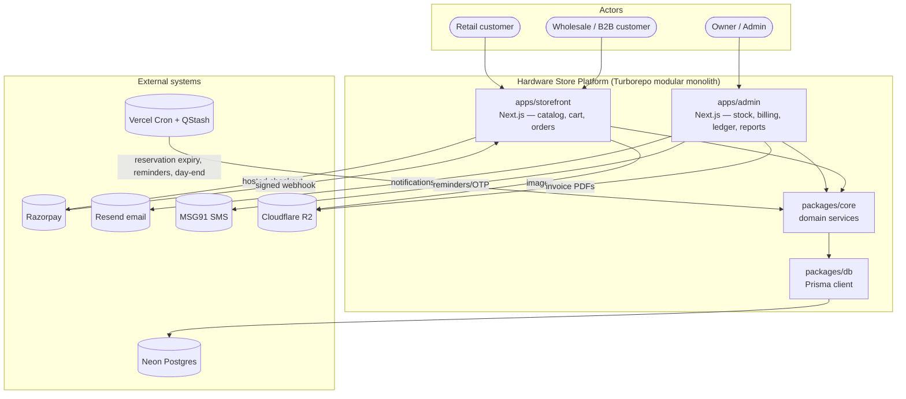
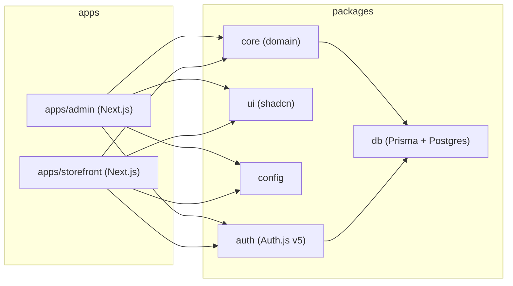
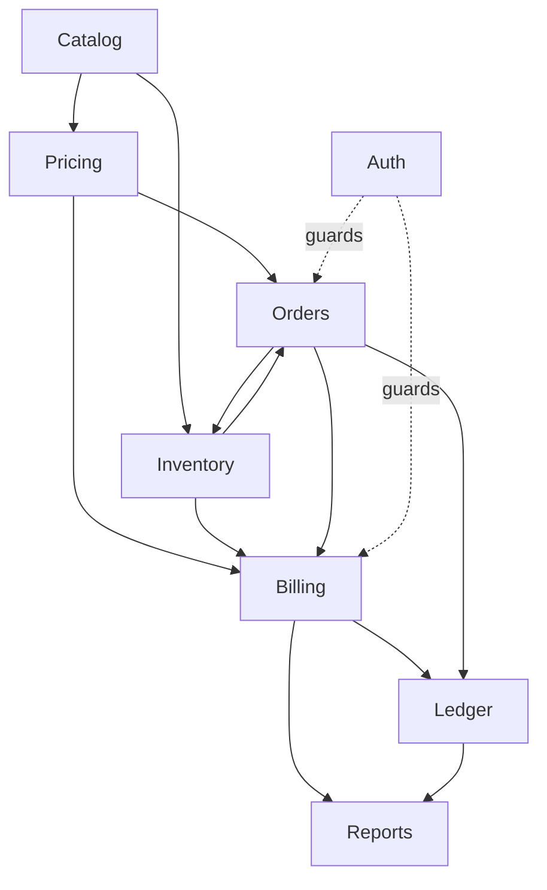
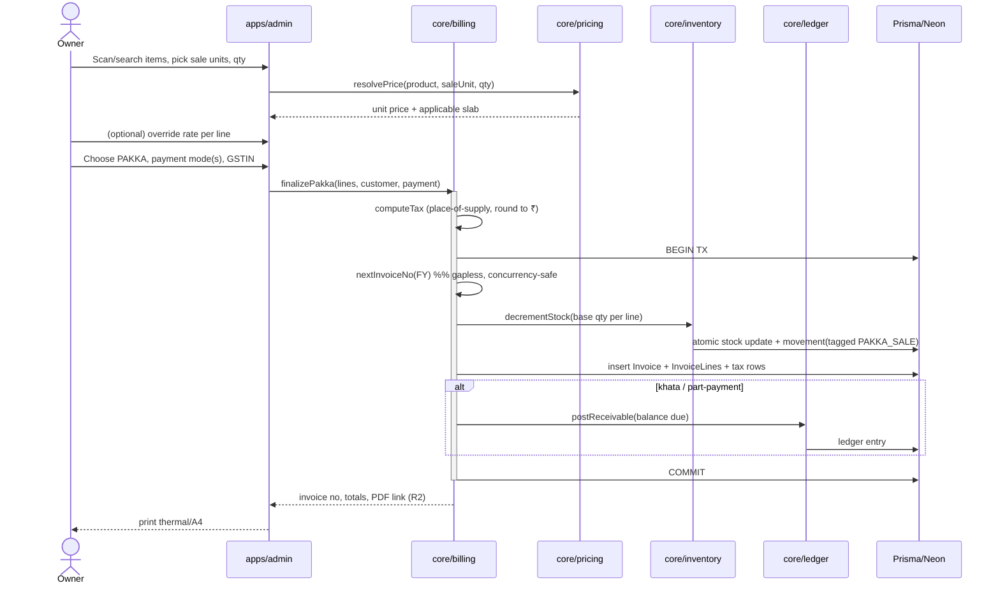
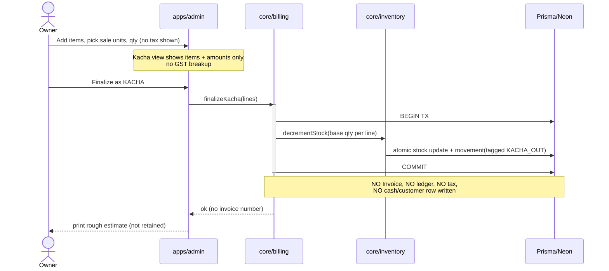
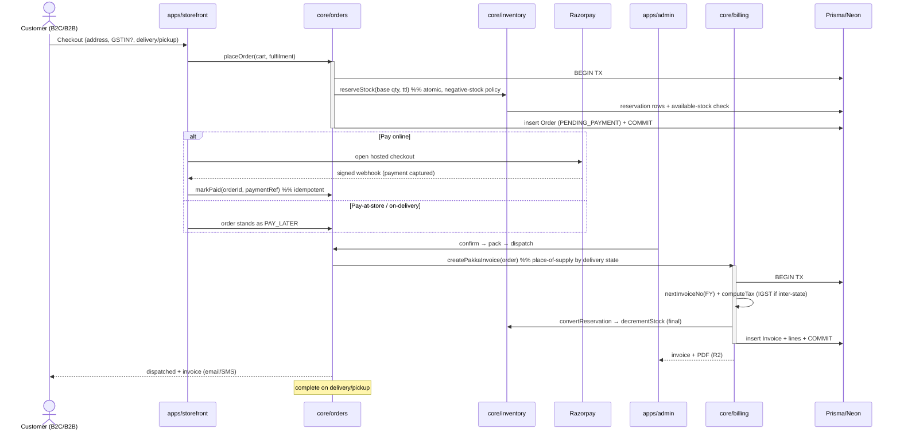
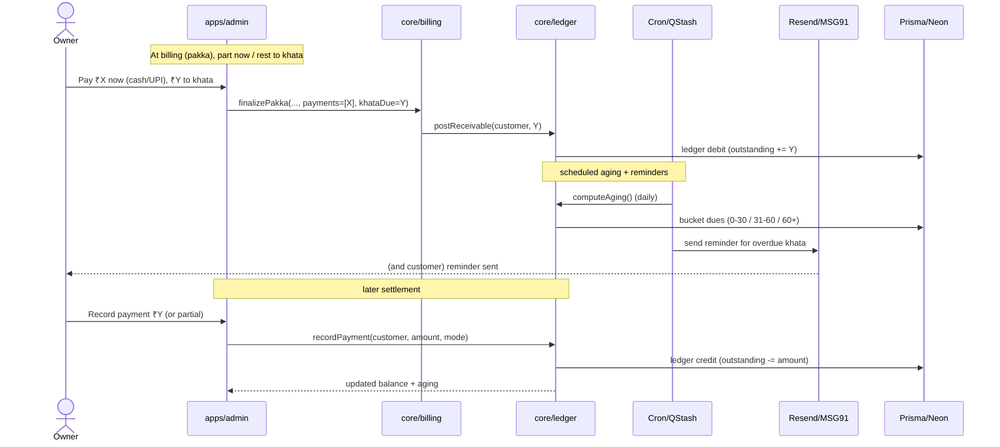

# Solution Architecture

**Status:** DRAFT · 2026-06-24
How the system fits together: actors, external systems, the two-app modular monolith, its modules, and the end-to-end flows that tie them together.

> This is the "shape of the system" view. Concrete schemas, endpoints and security controls live in siblings: data model in `06-data-architecture.md`, API surface in `04-api-design.md`, security in `07-security-architecture.md`, infrastructure in `05-infrastructure-architecture.md`, and the in-depth patterns (UoM, gapless numbering, idempotency) in `03-technical-architecture.md`.

---

## 1. System context

One GST-registered hardware store in India (turnover < ₹5 cr) running paint, electrical, fasteners, plumbing and tools. The software has three jobs — **manage stock**, **sell at the counter** (kacha + pakka billing) and **sell online** (B2C + B2B storefront) — over **one shared inventory**.

### Actors

| Actor | Where | What they do |
|-------|-------|--------------|
| **Owner / Admin** | `apps/admin` | Catalog + stock, counter billing (kacha/pakka), khata ledger, orders, GST reports, backups. Single login in v1 (RBAC extensible — see `07-security-architecture.md`). |
| **Retail customer (B2C)** | `apps/storefront` | Browse, add to cart, checkout, pay online or pay-at-store/on-delivery, track orders. Own account, separate from admin. |
| **Wholesale / B2B customer** | `apps/storefront` | Same storefront; sees **quantity-break bulk slabs** (no separate login), supplies **GSTIN at checkout** for a tax invoice, may **buy on khata** if an account customer. |

No separate cashier or stock-manager role in v1 — the owner is the only admin user. The schema and `packages/auth` are structured so roles *can* be added later without a rewrite.

### External systems

| System | Purpose | Notes |
|--------|---------|-------|
| **Razorpay** | Online payment (UPI/cards) + hosted checkout; webhook for capture | Card data never touches our servers; signed webhooks; idempotent (see `03`). |
| **Resend** (email) | Transactional email — order updates, khata reminders, receipts | Easy, no DLT. Primary notification channel for v1. |
| **MSG91** (SMS) | India DLT-compliant SMS — reminders/OTP | DLT template pre-approval needed; budget lead time. WhatsApp = phase 2. |
| **Cloudflare R2** | Product images / invoice PDFs (S3-compatible, no egress fees) | Signed URLs; see `05-infrastructure-architecture.md`. |
| **Neon (PostgreSQL)** | Single source of truth; pooled connection for serverless Prisma | Single DB shared by both apps via `packages/db`. |
| **Vercel Cron + Upstash QStash** | Scheduled + queued background jobs (reservation expiry, reminders, day-end) | No always-on worker on serverless; see §4 and `03`. |
| **Sentry / UptimeRobot** | Error tracking + uptime | Cross-cutting; not in domain flows. |

**Deferred external integrations (TBD switch-on):** GST **e-Invoice / IRP (IRN)** is deferred — turnover is below the ₹5 cr threshold — and **e-Way bill** generation is nice-to-have for goods movements above ₹50k. Both are designed as switch-on modules, not built in v1 (see `03` §"later splits" and `04`).

### C4 — System context & containers (level 1/2)

> e-Invoice/IRP and e-Way bill are intentionally **not** shown — deferred per the locked decisions.

---

## 2. The two-app modular monolith

Two deployables, **one database, one set of business rules**. Both apps are thin presentation/transport layers that call the same domain services in `packages/core`, which is the only layer allowed to touch `packages/db` (Prisma → Neon). This is a *modular monolith*, not microservices: clean internal boundaries today, the option to peel a module into its own service later (see `00-overview.md` and ADR-0001).

Why two apps and not one: the storefront is public, SEO-driven and read-heavy; the admin is private, write-heavy and latency-sensitive (a counter POS must respond instantly). Splitting them lets each scale and deploy independently while sharing types and rules. The package dependency graph and layering rules are detailed in `03-technical-architecture.md`.

---

## 3. Module map

Domain modules live in `packages/core` (one folder per module); the apps host their UI and route handlers/server actions. Each module owns its rules and exposes a typed service API; cross-module calls go through those services, never through another module's tables.

| Module | Owns | Key responsibilities |
|--------|------|----------------------|
| **Catalog** | Products, categories, brands, HSN, **units of measure** (base + sale units + conversion), batches/expiry, barcodes | Product CRUD, CSV/Excel import, UoM definitions, barcode + loose search (pg_trgm). The UoM model is the highest-risk piece — detailed in `03` §UoM. |
| **Inventory / Stock** | Stock-on-hand (in **base units**), stock movements, reservations, suppliers, GRN, adjustments, returns | Single source of truth for quantity. Atomic decrement, reservation TTL, negative-stock policy, near-expiry/low-stock alerts, supplier dues/payables. Every sale (incl. kacha) decrements here. |
| **Pricing** | Price-per-sale-unit, MRP, cost, **quantity-break slabs**, line/bill discounts | Resolve a price for a (product, sale unit, qty) tuple; expose slabs to storefront and counter; support **manual rate override** at billing. |
| **Billing** | Counter sale flow, **kacha** (zero-trace) + **pakka** (full GST tax invoice), invoice numbering, cancel/amend | Build a bill, compute tax (place-of-supply), round to rupee, generate **gapless** invoice numbers, convert kacha→pakka, issue credit notes. Pakka writes invoice + ledger + stock movement; kacha writes **only** a tagged stock movement. |
| **Ledger / Khata** | Customer credit ledger, outstanding, aging, part-payments, reminders | Post receivables from pakka/khata sales; record part-payments and settlements; compute aging buckets; feed reminder jobs. |
| **Orders / Ecommerce** | Cart, checkout, order lifecycle, delivery/pickup, reservations, payment linkage | Reserve stock atomically on placement; owner confirms; **pakka invoice on dispatch**; flow accept→pack→dispatch→complete; payment via Razorpay or pay-later. |
| **Auth** | Sessions, owner-admin login, customer accounts, RBAC scaffolding | Auth.js v5 with Prisma adapter; gates admin surface; isolates customer accounts from admin. Details in `07`. |
| **Reports / GST** | Sales reports, day-end, **GSTR-1 + HSN summary export**, stock/valuation, dues | Read-side aggregation over saved data (pakka invoices, credit notes, movements, ledger). Note: kacha is invisible here by design (zero trace). |

**Module boundary rule:** Orders and Billing both *produce sales*, but only **Billing** owns invoices and tax; Orders calls Billing to create the pakka invoice at dispatch. Only **Inventory** mutates stock; everyone else asks it to. This keeps the gapless-numbering and stock invariants in one place each.

---

## 4. End-to-end data flows

All sequence diagrams assume: requests land in a Next.js **server action or route handler**, which calls a **domain service in `packages/core`**, which runs inside a **Prisma transaction** against Neon. Transport/layering detail is in `03`.

### (a) Counter PAKKA sale

A saved, taxed tax invoice with a gapless number. Tax type is decided by place-of-supply (counter = intra-state → CGST/SGST, unless a different supply state applies). Stock comes down in the same transaction.

### (b) KACHA zero-trace sale

The deliberate exception: **nothing about the sale is saved** — no bill, value, cash, customer or tax. The *only* footprint is a **stock movement tagged KACHA**, which reads as an unattributed stock-out. Cash won't auto-reconcile; accepted tradeoff. Convertible to pakka before finalize (if converted, it follows flow (a) instead).

> The one-click **convert kacha→pakka** path simply abandons the kacha finalize and runs flow (a) with the same lines before any stock is committed — see `03` §"Kacha zero-trace".

### (c) Online order: reserve → confirm → dispatch → pakka invoice

Order **reserves** stock atomically on placement (with a reservation TTL so abandoned carts auto-release). The owner confirms, packs and dispatches; the **pakka invoice is generated on dispatch** (sale becomes a saved tax invoice + final stock deduction at hand-over). A delivery to another state is inter-state → IGST.

### (d) Khata part-payment + later settlement

Part-payment at billing puts the balance on the customer's credit ledger; aging accrues; reminders go out; the customer settles later (cash/UPI/card).

---

## 5. Integration points (summary)

| Integration | Trigger | Pattern | Reference |
|-------------|---------|---------|-----------|
| Razorpay checkout | Online order payment | Hosted checkout; **signed webhook** to confirm capture; **idempotent** order update | `03` §idempotency, `07` |
| Resend / MSG91 | Order status, khata reminders, OTP | Fire from server action or job; email primary, SMS via DLT templates | `04` |
| Cloudflare R2 | Product images, invoice PDFs | Signed upload/read URLs; no egress fees | `05` |
| Vercel Cron + QStash | Reservation expiry, khata reminders, day-end roll-up | Cron schedules → QStash queue → core service | `03` §jobs |
| Neon Postgres | All persistence | Pooled connection; all access via `packages/db` | `06` |
| **e-Invoice / IRP (IRN)** | **Deferred** | Switch-on module if turnover ≥ ₹5 cr; not in v1 | **TBD** |
| **e-Way bill** | Goods movement > ₹50k | Nice-to-have; not core v1 | **TBD** |

---

## 6. Cross-cutting concerns

- **One shared inventory** across billing + ecommerce — Inventory module is the single writer of stock (§3). Concurrency handled by atomic ops + reservations (`03`).
- **Audit / void log** — required for financial integrity even single-user; gapless numbering means **no deletes** (cancel or credit-note). Modelled in `06`, enforced in Billing.
- **Automated backup** — statutory tax-record retention ≈ 6 years; scheduled export (see `05`).
- **Security baseline** — Auth.js sessions, Zod validation everywhere, Razorpay signature verification, least-privilege DB, encrypted backups. Full treatment in `07-security-architecture.md`.
- **Kacha is invisible to Reports/GST by design** — only the tagged stock-out exists, separating "kacha sale" from true shrinkage at the movement level while keeping zero sale/cash history.

---

## 7. Assumptions (clearly labelled)

- **A1.** Counter sales default to **intra-state** (CGST/SGST); IGST applies when a supply state differs (mainly ecommerce inter-state delivery). The shop's home state is configured once. *(Per locked place-of-supply rule.)*
- **A2.** Notifications in v1 lean on **email (Resend)**; SMS (MSG91) used where DLT templates are approved; **WhatsApp is phase 2**.
- **A3.** Invoice **PDFs are stored in R2**; the canonical invoice data lives in Postgres. *(Storage choice — TBD if PDFs are generated on demand instead.)*
- **A4.** "Convert kacha→pakka" is only available **before finalize**; once a kacha stock-out is committed, there is no saved kacha sale to upgrade. *(Follows zero-trace decision.)*
- **A5.** Pay-at-store / pay-on-delivery orders still **reserve stock** on placement, same as prepaid orders. *(Consistent with "order reserves on placement".)*

Open items are marked **TBD** above and carried into `04`/`06`/`07` rather than invented here.
