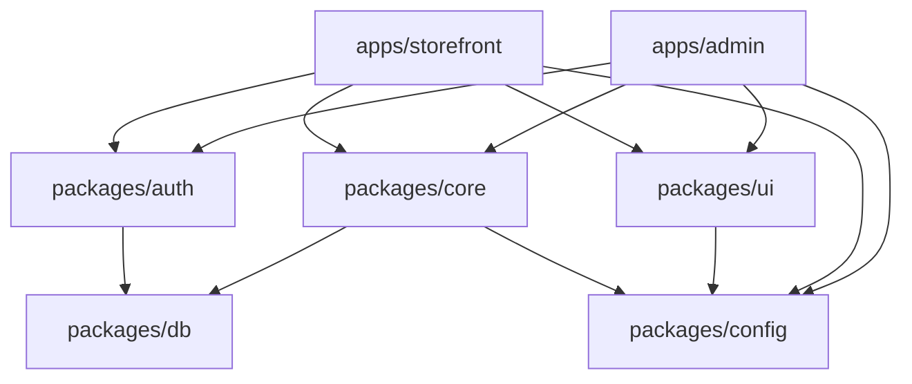
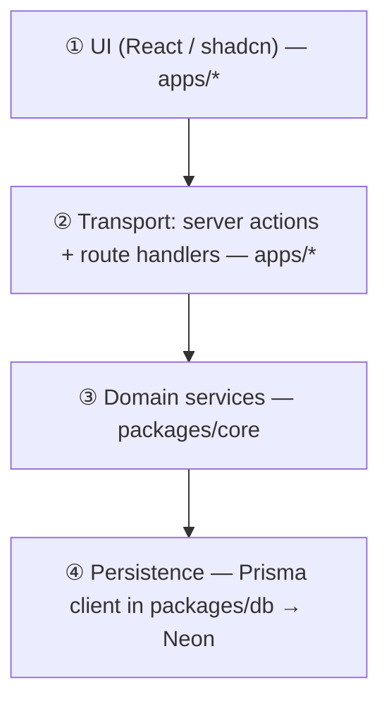
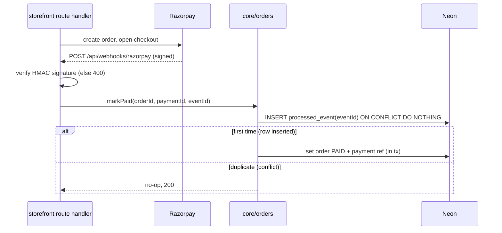

# Technical Architecture

**Status:** DRAFT · 2026-06-24
The engineering view: monorepo layout, layering and dependency rules, and the load-bearing patterns (UoM, atomic stock + reservations, kacha zero-trace, gapless invoice numbering, GST tax/rounding, Razorpay idempotency, background jobs, search).

> System shape and flows are in `02-solution-architecture.md`. Concrete schema lives in `13-data-architecture.md`, endpoints in `04-api-design.md`, security in `07-security-architecture.md`, infra in `05-infrastructure-architecture.md`. This doc explains *how* the hard parts work; it does not restate the catalog of features.

---

## 1. Monorepo layout

Turborepo + pnpm workspaces. Two apps, five packages; `packages/db` is the single source of truth and `packages/core` is the only place business rules live.

```
hardware/
├─ apps/
│  ├─ admin/        # Next.js — owner: stock, billing (kacha/pakka), ledger, reports
│  └─ storefront/   # Next.js — customers: catalog, cart, orders
├─ packages/
│  ├─ db/           # Prisma schema + generated client (single source of truth)
│  ├─ core/         # domain services: catalog, inventory, pricing, billing, ledger, orders, reports
│  ├─ auth/         # Auth.js v5 config + Prisma adapter (shared by both apps)
│  ├─ ui/           # shared shadcn/ui components
│  └─ config/       # shared tsconfig / eslint / tailwind presets
├─ turbo.json
└─ package.json     # workspaces
```

### Package dependency graph



**Hard rules (enforced by lint/`import` boundaries — see `04`):**
- Apps **never** import `packages/db` directly. They call `packages/core` (and `packages/auth`).
- `packages/core` is the **only** module allowed to import the Prisma client.
- `packages/core` has **no React / Next** imports — it is plain TypeScript so it can be reused or later extracted to a service.
- `packages/auth` may touch `db` (Auth.js Prisma adapter needs the user/session tables) but exposes session helpers, not raw queries.
- No app imports the other app.

---

## 2. Layering

Four layers, top to bottom. Each layer only calls the one below it.



| Layer | Lives in | Responsibility |
|-------|----------|----------------|
| ① UI | `apps/*/app/**` (React, shadcn from `packages/ui`) | Render, collect input, optimistic UI. No business logic. |
| ② Transport | `apps/*` **server actions** (mutations) + **route handlers** (`route.ts` for webhooks, REST-ish, cron) | Authn/authz via `packages/auth`; **Zod validation** of every input; call a single domain service; shape the response. Thin. |
| ③ Domain | `packages/core/<module>/service.ts` | All rules: UoM conversion, pricing, tax, gapless numbering, reservations, ledger math. Owns transaction boundaries. Pure TS. |
| ④ Persistence | `packages/db` (Prisma) | Schema, migrations, generated client, **pooled** connection to Neon. Parameterized queries only. |

**Why server actions for mutations and route handlers for the rest:** server actions give type-safe, RPC-style calls from the counter/storefront UI with the least plumbing; route handlers cover the things that aren't UI calls — the **Razorpay webhook**, **cron/QStash** endpoints, and any future public API. Both converge on the same `packages/core` services, so there is exactly one implementation of each rule.

**Transaction ownership:** transactions are opened **in the domain service** (`prisma.$transaction(...)`), never in the UI or transport layer. A single user action that must be atomic (finalize a pakka invoice, place an order) is one service call = one transaction.

---

## 3. Module boundaries & allowed dependencies

Modules in `packages/core` talk to each other **only through exported service functions**, never by reaching into another module's tables. The dependency direction matches `02` §3:

| Module | May call | Must not |
|--------|----------|----------|
| catalog | — (leaf, + db) | call billing/orders |
| pricing | catalog | write stock or invoices |
| inventory | catalog | compute tax or prices |
| billing | pricing, inventory, ledger | be called by catalog/pricing |
| orders | pricing, inventory, billing, ledger | own invoice numbering |
| ledger | — (+ db) | mutate stock |
| reports | (read models across modules) | mutate anything |

Two invariants this protects: **only Inventory mutates stock**, and **only Billing mints invoice numbers and tax rows**. Orders, which produces sales, *delegates* to Billing at dispatch rather than duplicating that logic.

---

## 4. Key pattern — Unit-of-measure (UoM) model

The core of the product. Stock is held in **one base unit per product**; the product also has **one or more sale units**, each with a **conversion factor to the base unit** and **its own price** (a coil is priced as a coil, not forced to 90× the per-metre price). Measured units (length/weight/volume) allow **decimals**; piece-type units stay **whole**.

**Shape (conceptual — full schema in `13-data-architecture.md`):**

| Entity | Key fields |
|--------|-----------|
| `Product` | `baseUnitId`, `hsn`, `costPerBaseUnit`, … |
| `Unit` | `code` ("m", "coil", "L", "bucket", "pc", "box"), `kind` (`MEASURED` \| `PIECE`) |
| `ProductSaleUnit` | `productId`, `unitId`, `factorToBase` (Decimal), `pricePerSaleUnit`, `isDefault` |

**Conversion — the one rule everything depends on:**

```
baseQty = saleQty × factorToBase
```

A sale line records the **sale unit and sale qty** the customer/counter chose, but **stock always moves in base units**. Example: wire base unit = metre; sale unit "coil" with `factorToBase = 90`. Selling 2 coils → `2 × 90 = 180` base metres decremented; line priced at `2 × pricePerSaleUnit(coil)`.

**Decimal vs whole, precision:**
- `MEASURED` units accept decimal `saleQty` (e.g., 2.5 kg). `PIECE` units must be integers; the service rejects fractional pieces.
- `factorToBase` and quantities use **Prisma `Decimal`** (not float) to avoid binary rounding drift. Display/step precision per unit is a catalog setting. **TBD:** exact decimal scale (proposed: 3 dp for qty, matching `13`).

**Edge cases (from the review, P2):** an item sold both by piece and by weight needs a weight-per-piece factor (two sale units pointing at a weight base, or a piece base with a kg sale unit — **TBD**, decided in `13`); coil "≈90 m" actual-length variance is handled by allowing a per-batch override of `factorToBase` if needed. Pricing slabs (quantity-break) attach to `ProductSaleUnit` and are resolved by the Pricing service for a `(product, saleUnit, qty)` tuple.

---

## 5. Key pattern — Atomic stock decrement, reservations & negative-stock policy

One shared pool feeds the counter and the storefront, so every quantity change must be **atomic** and **race-safe**.

**Stock state (conceptual):**

```
on_hand        = sum of all StockMovement (signed, in base units)
reserved       = sum of active Reservation (not expired, not converted)
available      = on_hand − reserved
```

**Decrement inside a DB transaction (counter pakka/kacha, order dispatch):**

```ts
// packages/core/inventory/service.ts (sketch)
await prisma.$transaction(async (tx) => {
  // conditional, atomic: only succeeds if enough is free
  const updated = await tx.$executeRaw`
    UPDATE "ProductStock"
    SET on_hand = on_hand - ${baseQty}
    WHERE product_id = ${productId}
      AND on_hand - reserved >= ${baseQty}`;   // negative-stock guard
  if (updated === 0) throw new InsufficientStock(productId);
  await tx.stockMovement.create({ data: { productId, baseQty: -baseQty, kind } });
});
```

The `WHERE … >= baseQty` makes the check-and-decrement a **single atomic statement** — no read-then-write race. The whole thing is wrapped in `prisma.$transaction` so the movement row and the running total never diverge.

**Reservation with TTL (online orders):** placing an order creates `Reservation` rows (base qty, `expiresAt = now + TTL`) and an order in `PENDING_PAYMENT`/`PAY_LATER`. `available` subtracts active reservations, so the counter can't sell stock an order is holding, and vice-versa. A background job (§9) releases expired reservations; on **dispatch**, the reservation is *converted* to a real decrement in one transaction (it does not double-count).

**Negative-stock policy:** default is **block** (the guard above rejects oversell). The owner can mark specific products/movement types as **allow-negative** (e.g., back-orderable, or to not block a counter sale of a loose item that's slightly miscounted) — a per-product flag read by the service. **TBD:** default for adjustments/returns (proposed: returns always allowed, sales blocked unless flagged).

**Reservation TTL value: TBD** (proposed 30 min for unpaid carts; prepaid orders hold until cancelled).

---

## 6. Key pattern — Kacha zero-trace implementation

The deliberate exception. A kacha finalize must write **exactly one thing: a stock movement, tagged `KACHA_OUT`** — and nothing else. No invoice, no sale, no value, no cash, no customer, no tax, no ledger row.

```ts
// packages/core/billing/service.ts (sketch)
async function finalizeKacha(lines: KachaLine[]) {
  await prisma.$transaction(async (tx) => {
    for (const l of lines) {
      const baseQty = l.saleQty.mul(l.factorToBase);     // UoM conversion (§4)
      await decrementStock(tx, l.productId, baseQty, "KACHA_OUT");
    }
  });
  // returns nothing identifiable — no invoice number, no totals persisted
}
```

Consequences, all accepted and by design:
- The tagged `KACHA_OUT` movement lets **Reports/GST separate "kacha sale" from real shrinkage** at the movement level, while still storing **no sale/value/cash** — the strongest form of zero-trace that keeps inventory honest.
- The cash drawer **won't auto-reconcile** for kacha (no value stored); manual reconciliation accepted.
- A kacha-bought item has **no record to return against**; kacha returns are out of scope.
- **Convert kacha→pakka:** the kacha view is just an in-memory bill. "Convert" never calls `finalizeKacha`; it calls `finalizePakka` with the same lines (§7/§8), so the *only* persisted outcome is the proper tax invoice. There is no upgrade path from a committed `KACHA_OUT` — conversion happens **before** finalize.

> No "minimal daily kacha aggregate" is stored — the locked decision is **zero trace** (overriding the review's P0-#1 suggestion). The single tag on the stock movement is the only concession.

---

## 7. Key pattern — Gapless, concurrency-safe invoice numbering (per financial year)

A GST tax invoice needs a **gapless sequential number**, and India's GST year runs **April→March**, so the sequence **resets each financial year** (e.g., `2026-27/000123`). Two requirements fight each other: numbers must have **no gaps**, and **concurrent** finalizations (counter + an order dispatch at once) must not collide or skip.

**Approach — a counter row locked inside the invoice transaction:**

```ts
// inside the SAME transaction that writes the invoice
const fy = financialYear(now);                       // "2026-27"
const row = await tx.$queryRaw`
  UPDATE "InvoiceCounter"
  SET last_no = last_no + 1
  WHERE fy = ${fy}
  RETURNING last_no`;                                 // row-level lock until COMMIT
const invoiceNo = format(fy, row.last_no);            // 2026-27/000124
await tx.invoice.create({ data: { invoiceNo, fy, ... } });
```

Why this is gapless and safe:
- The `UPDATE ... RETURNING` takes a **row lock** on that FY's counter; a second transaction blocks until the first **commits or rolls back**.
- The number is allocated **in the same transaction** as the invoice insert. If the invoice insert fails, the increment **rolls back** too — so a failed bill does not burn a number (no gap). A number is only "used" if its invoice is committed.
- A `unique(fy, invoiceNo)` constraint is a backstop against any bug.
- Because we **never delete** invoices, the sequence stays gapless for life; cancellations and returns use **cancel flags / credit notes** (separate credit-note series — **TBD** whether credit notes share or have their own sequence; proposed: own `CN` series, also gapless).

**FY rollover** is automatic: `financialYear(now)` returns the new FY on/after 1 April, and the counter row for the new FY starts at 0. Series format is configurable (`<FY>/<6-digit>` proposed).

---

## 8. Key pattern — Place-of-supply tax + GST rounding

Tax type is decided by **place of supply vs the shop's home state**:

| Condition | Tax |
|-----------|-----|
| Supply state **==** shop state (counter sale; intra-state delivery) | **CGST + SGST** (each = rate/2) |
| Supply state **!=** shop state (inter-state, e.g., online delivery to another state) | **IGST** (= full rate) |

```ts
function computeLineTax(taxable: Decimal, rate: Decimal, supplyState, shopState) {
  if (supplyState === shopState) {
    const half = taxable.mul(rate).div(2).div(100);
    return { cgst: half, sgst: half, igst: ZERO };
  }
  return { cgst: ZERO, sgst: ZERO, igst: taxable.mul(rate).div(100) };
}
```

**Order of operations (locked):** **discount is applied before tax**; line discounts and any bill discount reduce the **taxable value**, then tax is computed on the net. MRP-inclusive items are **back-calculated** (`taxable = mrp × 100 / (100 + rate)`) so the displayed MRP is honoured.

**GST rounding (locked → round to rupee):** tax is computed per line in `Decimal`, summed per tax head, and the **invoice total is rounded to the nearest rupee** with a `round_off` line capturing the delta (the standard Indian invoice "Round Off ₹0.40" line). Proposed rule: **per-invoice rounding** on the final payable (not per-line), which matches how most accountants reconcile. **TBD:** confirm per-line vs per-invoice with the owner's accountant; the rate→HSN auto-lookup and GSTIN format/checksum validation live in Catalog/Billing input validation (`04`).

All money/qty math uses `Decimal`; no floats touch tax or totals.

---

## 9. Key pattern — Razorpay payment & webhook idempotency

Online payment uses Razorpay **hosted checkout** (card data never reaches us). The source of truth for "paid" is the **signed webhook**, not the browser redirect (which can be lost). Both the redirect callback and the webhook can arrive — possibly more than once — so the update must be **idempotent**.



- **Signature verification** on every webhook (HMAC with the Razorpay secret); reject otherwise. (Security detail in `07`.)
- **Idempotency key = Razorpay `event id`** (and/or `payment id`) stored in a `ProcessedWebhook`/`processed_event` table with a unique constraint. `INSERT … ON CONFLICT DO NOTHING` makes re-delivery a safe no-op.
- The order state transition (`PENDING_PAYMENT → PAID`) happens **in the same transaction** as recording the event, so we never mark paid twice or half-apply.
- Outbound calls that create a Razorpay order use a stable client-side **idempotency reference** to avoid duplicate gateway orders on retry. Refunds (returns of online orders) follow the same pattern. **TBD:** retention window for processed-event rows.

---

## 10. Key pattern — Background jobs (Vercel Cron + Upstash QStash)

Serverless has **no always-on worker**, so scheduled work is driven by **Vercel Cron** (time triggers) which enqueues to **Upstash QStash** (a managed queue with retries); QStash calls back into a **route handler** that runs the relevant `packages/core` service. (If production later moves to a VPS, pg-boss replaces this — noted in `01`.)

| Job | Schedule | Does |
|-----|----------|------|
| **Reservation expiry** | every few minutes | Release `Reservation` rows past `expiresAt`, freeing `available` stock (§5). |
| **Khata reminders** | daily | Recompute aging buckets; send overdue reminders via Resend/MSG91 (`02` flow d). |
| **Day-end roll-up** | nightly | Sales summary by day/item/category/payment mode for the dashboard + reports (kacha excluded by design). |
| **Backup / export** | scheduled | Statutory retention ≈ 6 years; export to R2 (detail in `05`). |
| **Near-expiry / low-stock alerts** | daily | Flag batches nearing expiry and items below reorder level. |

Jobs are **idempotent** and safe to retry (QStash redelivers on failure): each operates on a query of current state (e.g., "reservations where expired") rather than assuming exactly-once delivery. Cron/QStash callback endpoints are authenticated route handlers (shared secret / signature — `07`).

---

## 11. Key pattern — Search (Postgres FTS + pg_trgm)

~500–5k SKUs needs typeahead and tolerant matching, not a paid search service. Two complementary Postgres features:

- **`pg_trgm`** (trigram) for **fuzzy / loose** search and typo tolerance — the counter "search-by-name/code for loose, unbarcoded items" and storefront search. A GIN trigram index on `name`/`sku`/`brand` powers `ILIKE`/similarity queries.
- **Full-text search** (`tsvector`) for word-based product search where useful.
- **Barcode** path is an exact unique-index lookup (branded items scanned at billing) — no fuzzy matching needed.

Index strategy and exact column list are in `13-data-architecture.md`; this is sufficient for the SKU count without Algolia/Elastic (`01` "not chosen").

---

## 12. How modules could later split into services

The monolith is modular precisely so the busy modules can be **peeled off without a rewrite** (`00-overview.md` scale-later path, ADR-0001). Because every module already:

1. exposes a **typed service API** (no cross-module table access),
2. owns its **transaction boundaries**, and
3. lives in plain TS (`packages/core`, no Next/React coupling),

…a module can be lifted into its own deployable behind the **same API contract** with minimal churn. Likely first candidates:

| Candidate | Why it would split first | What changes |
|-----------|--------------------------|--------------|
| **Orders / Ecommerce** | Public, traffic-spiky, independent scaling | Becomes a service; storefront calls it over HTTP instead of in-process; reservation/stock calls become a remote call to Inventory. |
| **Billing** | Write-heavy, latency-sensitive, compliance-critical | Owns invoice numbering + tax behind an API; counter and Orders call it remotely. |
| **Reports / GST** | Read-heavy aggregation; could move to a read replica | Point at a Postgres read replica; no writes to coordinate. |

The hard part — keeping stock and numbering **consistent across a network boundary** — is deferred until traffic actually demands it; in v1 they share a transaction, which is simpler and correct. **The switch-on e-Invoice/IRP module** (deferred, `02`) would slot in as a Billing extension at that point.

---

## 13. Assumptions (clearly labelled)

- **A1.** Money and quantity use Prisma **`Decimal`** end-to-end; floats are never used for tax/price/qty. *(Required for gapless/GST correctness.)*
- **A2.** Invoice number format `<FY>/<6-digit>` (e.g., `2026-27/000124`); credit notes get their **own** gapless series. **TBD** confirm format + CN series.
- **A3.** GST rounding is **per-invoice** to the nearest rupee with a `round_off` line. **TBD** confirm per-line vs per-invoice with the accountant.
- **A4.** Default reservation TTL ≈ **30 min** for unpaid carts; prepaid orders hold until confirmed/cancelled. **TBD** confirm value.
- **A5.** Negative stock is **blocked** by default; **allow-negative** is a per-product opt-in; returns/adjustments are not blocked. **TBD** confirm adjustment policy.
- **A6.** Idempotency key for Razorpay is the **event id** (+ payment id), stored with a unique constraint. **TBD** processed-event retention window.
- **A7.** Background jobs run on **Vercel Cron → QStash → route handler**; all jobs are retry-safe/idempotent. Swappable to pg-boss on a VPS.

Items marked **TBD** are genuinely open and resolved in `06`/`04`/`07` — not invented here.
