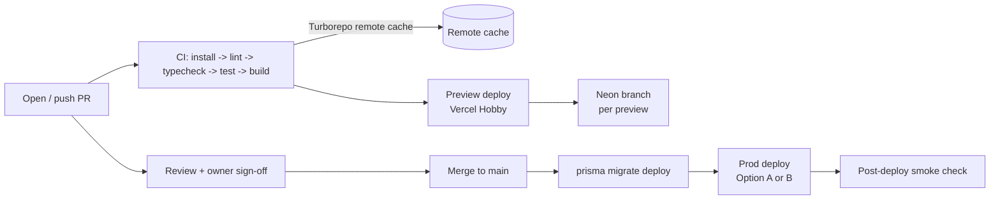
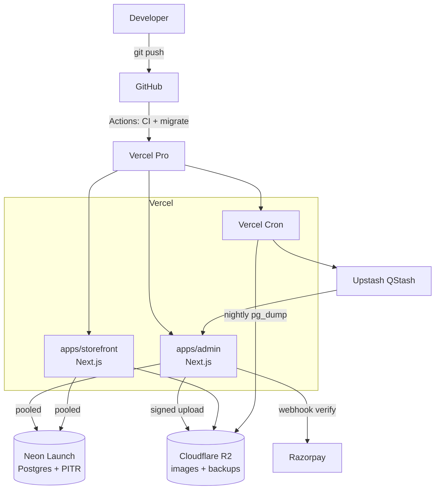
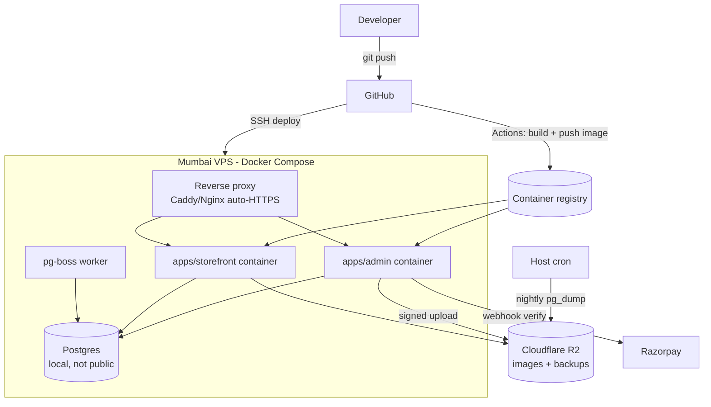

# Infrastructure Architecture

**Status:** DRAFT · 2026-06-24
How and where this app runs across environments — the FREE dev stack, the two go-live options (managed serverless vs Mumbai VPS), CI/CD, database, storage, secrets, and backups with GST-aware retention.

> Reads alongside `01-tech-stack.md` (the *what we build with*) and `06-network-architecture.md` (domains, TLS, request flow). Security controls live in `07-security-architecture.md`; data/retention modelling in `08-*`. This doc is the *where and how it runs*.

## Scope and guiding constraints

This is a web app for **one** GST-registered hardware store in India (turnover < ₹5 cr), built as a **modular monolith in a Turborepo**: `apps/admin` (Next.js — stock, billing kacha/pakka, ledger, reports) and `apps/storefront` (Next.js — B2C + B2B catalog, cart, orders), sharing packages `db / core / auth / ui / config`.

Infrastructure is shaped by four locked facts:

1. **Free during development** — the whole non-production stack costs **₹0** (Vercel Hobby + Neon free + Upstash free).
2. **Vercel Hobby is non-commercial only** — a live, revenue-earning shop *cannot* legally run on it, so go-live requires a paid tier.
3. **Cold starts are bad for a counter POS** — the admin billing screen must respond instantly when a customer is at the counter; free serverless cold starts (hundreds of ms to seconds) are unacceptable for that flow.
4. **GST record retention ≈ 6 years** and an **audit/void log** is required — so backups are a compliance feature, not just disaster recovery.

Region: **no preference** (pick nearest free region in dev; Mumbai preferred at go-live for latency + INR billing if the VPS path is chosen).

---

## 1. Environments

Three environments, deliberately cheap-to-free until the shop actually trades.

| Environment | Purpose | Compute | Database | Jobs / Queue | Cost |
|-------------|---------|---------|----------|--------------|------|
| **Local dev** | Day-to-day coding on a laptop | `next dev` (Turborepo `dev` task) for both apps | Neon free **dev branch** (or local Docker Postgres) | QStash test endpoint / no-op | ₹0 |
| **Preview / staging** | Per-PR review, QA, demos to the owner | Vercel Hobby preview deployments (auto per PR) | Neon **branch-per-preview** (copy-on-write) | Upstash free | ₹0 |
| **Production** | The live shop (counter POS + storefront) | **Go-live tier** (Option A or B below) | Neon Launch *or* VPS-local Postgres | QStash / pg-boss | **small monthly** |

Notes:

- **Local dev** uses a Neon dev branch so every developer shares the same schema shape without standing up Postgres locally; a local Docker Postgres is the offline fallback (matches the Dockerised packaging in `01-tech-stack.md`).
- **Preview** is genuinely free and safe because each PR gets an **isolated Neon branch** — destructive migrations or seed data never touch production. Preview URLs are shareable with the shop owner for sign-off.
- **Production** is the only environment that costs money, and only from go-live. It is the only environment subject to backup/retention rules below.

---

## 2. Hosting: dev (FREE) vs the two go-live options

### 2.1 Development stack — ₹0

| Component | Service | Plan | Notes |
|-----------|---------|------|-------|
| App compute | **Vercel Hobby** | Free | Both Next.js apps; preview deploy per PR. **Non-commercial only.** |
| Database | **Neon** | Free | Scales to zero; branch-per-preview; PITR within free retention window. |
| Queue / cron helper | **Upstash QStash** | Free | Reminders, reservation-expiry, day-end jobs (see `01-tech-stack.md`). |
| Images | **Cloudflare R2** | Free tier | S3-compatible, no egress fees; signed uploads. |
| Email / SMS | Resend/SES · MSG91 | Free/usage | Negligible during dev. |
| Monitoring | Sentry (free) · UptimeRobot | Free | Error + uptime visibility at no cost. |

This is the correct state **until the shop goes live**. It is explicitly *not* a production posture: non-commercial licensing + cold starts rule it out for a trading shop.

### 2.2 Go-live options

At go-live we move production to **one** of these. Nothing in the build locks us in — standard Next.js + Prisma + Postgres run on either.

**Option A — Managed serverless (Vercel Pro + Neon Launch).** Push-to-deploy, autoscaling, near-zero ops. We pay for the platform to run and scale the app and to keep the DB warm.

**Option B — Single Mumbai VPS (Docker Compose).** One small Mumbai VPS running the app container(s) + Postgres + a reverse proxy (Caddy/Nginx) via Docker Compose. Lowest cost, data stays in India, INR billing, zero vendor lock-in — but we own backups, patching, and scaling.

#### Comparison

| Dimension | **A: Vercel Pro + Neon Launch** | **B: Mumbai VPS + Docker Compose** |
|-----------|----------------------------------|-------------------------------------|
| ~Monthly cost (₹) | **~₹2,100** (Vercel Pro ~$20 + Neon Launch ~$5) | **~₹450** (VPS ~$5–6; Postgres self-hosted on the box) |
| Commercial use | ✅ Allowed (Pro is licensed for commercial) | ✅ Allowed (you own the box) |
| Cold starts | Largely mitigated on Pro; warm functions / fluid compute | ✅ None — long-running Node process, instant POS response |
| Ops burden | **Low** — platform handles deploys, TLS, scaling, DB ops | **Higher** — you patch the OS, run Postgres, manage backups, renew nothing (Caddy auto-TLS) but monitor it |
| Scaling | Automatic (serverless) | Vertical first (bigger VPS); horizontal later (Docker image is portable) |
| Data residency | Neon region selectable; confirm Mumbai availability — **TBD** | **In India** (Mumbai) by construction |
| Billing | USD (RBI e-mandate caveat — see below) | **INR** (no e-mandate surprises) |
| Backups | Neon PITR built in + our pg_dump to R2 | **Entirely ours** — pg_dump cron to R2 is mandatory |
| Best when | We want speed-to-market and minimal ops | We want lowest cost + India residency + no lock-in |

> ⚠️ **Vercel Hobby non-commercial caveat:** the free Hobby plan may **not** be used for the live shop. Production on the managed path means **Vercel Pro**, full stop.
> ⚠️ **Cold-start caveat:** free serverless cold starts make the counter POS feel laggy. Both go-live options remove this (Pro keeps functions warm; the VPS runs a persistent process).
> ⚠️ **RBI e-mandate (Option A):** Indian banks block international recurring charges by default; pay the USD Vercel/Neon bills with a card that has international payments enabled, or prefer Option B for clean INR billing. (Also noted in `00-overview.md`.)

**Recommendation:** default to **Option B (Mumbai VPS)** for a single-shop, cost-sensitive, India-resident deployment with a latency-critical POS; choose **Option A** if the owner wants zero ops and is comfortable with ~₹2,100/mo and USD billing. Final pick is made *at launch* — **TBD**.

---

## 3. CI/CD pipeline (GitHub Actions)

One pipeline, Turborepo-aware, gated on green checks before any deploy. See `01-tech-stack.md` for the toolchain.

**On every PR**
- `pnpm install` (cached) → **lint** → **typecheck** → **unit/integration tests** → **build**, all via Turborepo tasks.
- **Turborepo remote cache** so unchanged packages are not rebuilt across runs/branches (faster CI, lower minutes).
- **Preview deploy per PR** to Vercel Hobby, wired to a **Neon branch** seeded from a sanitised snapshot — shareable preview URL for owner sign-off.

**On merge to `main`**
- Re-run the full check matrix.
- **DB migrations** via **`prisma migrate deploy`** against production (forward-only; never `migrate dev` in CI). Migration job runs *before* the app deploy so the schema is ready.
- **Prod deploy**:
  - *Option A* — Vercel production deployment (Git-driven).
  - *Option B* — build & push the **Docker image** to a registry, then the VPS pulls and `docker compose up -d` (via SSH action or a small webhook/watchtower). Reverse proxy reloads with zero downtime.
- **Post-deploy smoke check** (health endpoint + a read query) and Sentry release tagging.

**Safeguards**
- Branch protection on `main`: no merge without green CI + review.
- Migrations are reviewed in PR (the SQL is committed) so destructive changes are caught before `main`.
- Secrets injected from GitHub Actions secrets / environment; never in the repo (see §6).

---

## 4. Database (Neon Postgres)

PostgreSQL on **Neon**, accessed through Prisma. Connectivity details (TLS, pooler endpoint) are in `06-network-architecture.md`; here is the operational shape.

- **Pooled connection for serverless.** Prisma on Vercel uses Neon's **pooler endpoint** (PgBouncer-style) to avoid exhausting Postgres connections under serverless fan-out. The unpooled/direct URL is used only for migrations. (Prisma Accelerate is an alternative if pooling pressure grows.)
- **Branch-per-preview.** Each PR gets a Neon branch (copy-on-write from `main`) — instant, cheap, isolated. CI creates it on open and deletes it on merge/close.
- **PITR (point-in-time recovery).** Neon retains WAL for a window (longer on Launch than Free), enabling restore to any second within that window — first line of defence against bad writes/migrations.
- **Migrations.** Prisma Migrate, forward-only in CI (§3). Schema is the single source of truth in `packages/db`.
- **Option B variant.** If production runs on the Mumbai VPS, Postgres runs **inside Docker Compose on the same box**, *not* publicly exposed (see network doc). It then has **no managed PITR**, which makes the scheduled `pg_dump` in §7 mandatory and the primary recovery mechanism.

---

## 5. Object storage (Cloudflare R2)

- **Product images** (and any future invoice PDFs / exports) live in **Cloudflare R2** — S3-compatible, **no egress fees**, cheap for image-heavy catalog pages.
- **Signed uploads**: the admin app issues a short-lived **presigned URL**; the browser uploads directly to R2 (the app never proxies image bytes). Keys/secrets stay server-side.
- **Serving**: images are served via R2 + CDN with long cache lifetimes (caching/CDN posture in `06-network-architecture.md`).
- **Buckets**: separate buckets/prefixes per environment (`dev-`, `prod-`) so preview uploads never collide with production assets.
- R2 also doubles as the **off-site backup target** for database dumps (§7) — one storage account, no egress cost to write or restore.

---

## 6. Secrets management

No secret ever lives in the repo. Per environment:

| Environment | Where secrets live | Examples |
|-------------|--------------------|----------|
| Local dev | `.env.local` (git-ignored) | `DATABASE_URL` (dev branch), R2 keys, Razorpay **test** keys, Auth.js secret |
| Preview | Vercel project env vars (Preview scope) | Same shape, test/sandbox credentials |
| Production — Option A | **Vercel env vars** (Production scope), encrypted at rest | Live Razorpay keys + webhook secret, Neon Launch URL, R2 prod keys, MSG91/Resend keys, Sentry DSN |
| Production — Option B | **VPS secret file** (root-owned `.env`, `chmod 600`) loaded by Docker Compose; *not* in the image | Same set; rotated via SSH |
| CI | GitHub Actions secrets / environments | Deploy tokens, migration `DATABASE_URL`, registry creds |

- **Razorpay webhook secret** and **Auth.js session secret** are the highest-sensitivity values — verify webhook signatures with the former (see `06`/`07`).
- Rotation: documented runbook — **TBD** (target: rotate on staff change / suspected leak; quarterly for payment keys).

---

## 7. Backup strategy, RPO/RTO, and GST retention

Backups serve **two** masters: disaster recovery *and* **~6-year GST record retention**. The audit/void log (a DB table) is covered by the same database backups.

**Layers**

1. **Neon PITR** (Option A, or Neon-hosted) — continuous WAL; restore to any point in the retention window. Primary recovery for recent incidents.
2. **Scheduled logical dump** — a nightly **`pg_dump`** (cron via Vercel Cron/QStash on Option A, or a host cron on the VPS for Option B) writes a **compressed, encrypted** dump to a dedicated **R2 backup bucket**.
3. **Long-term retention** — monthly dumps are promoted to a **6-year retention** prefix in R2 (object lifecycle: keep ≥ 6 years to satisfy GST; expire daily dumps after ~35 days). This is the legal-retention copy, independent of Neon's PITR window.
4. **Storage backups** — R2 itself holds product images; versioning enabled so an accidental overwrite/delete is recoverable.

**Targets**

| Metric | Target | Basis |
|--------|--------|-------|
| **RPO** (max data loss) | **≤ 24 h** worst case (last nightly dump); **≈ minutes** when PITR is available (Option A) | Nightly dump floor; PITR ceiling |
| **RTO** (time to restore) | **≤ 4 h** for full prod restore | Pull dump from R2 → restore to fresh DB → redeploy app |
| **GST retention** | **≥ 6 years** for invoices, ledger, audit/void log | Indian GST record-keeping requirement |

**Recovery drill:** restore the latest dump into a throwaway Neon branch / scratch Postgres quarterly to prove RTO and dump integrity — **TBD** to schedule. Encryption keys for dumps are held in secrets (§6), *not* alongside the dumps.

> Option B caveat: on the VPS path there is **no managed PITR**, so the nightly `pg_dump` → R2 is the *only* recovery mechanism — its RPO floor (≤ 24 h) is the real one. Consider WAL archiving to R2 if a tighter RPO is needed later.

---

## 8. Deployment diagrams

### Option A — Vercel Pro + Neon Launch

### Option B — Single Mumbai VPS (Docker Compose)

(`pg-boss` replaces QStash on the VPS, per `01-tech-stack.md`.)

---

## 9. Cost timeline (₹)

| Phase | Stack | ~Monthly | Notes |
|-------|-------|----------|-------|
| **Development** (now) | Vercel Hobby + Neon free + Upstash free | **₹0** | Non-commercial; cold starts tolerated; demos via preview URLs |
| **Go-live — Option A** | Vercel Pro + Neon Launch | **~₹2,100** | + Razorpay 2% + GST per txn; domain ~₹900/yr; email/SMS by usage |
| **Go-live — Option B** | Mumbai VPS + self-hosted Postgres | **~₹450** | Same per-txn / domain / messaging extras; you own ops + backups |

Cross-cutting at launch (either option): **Razorpay 2% + GST** per successful transaction, **domain ~₹900/yr**, email/SMS metered. Trajectory: **₹0 while building → ₹450–2,100/mo from the day the shop trades**, scaling vertically before any architectural change (the modular monolith makes later extraction incremental — see `00-overview.md`).

---

## Open items (TBD)
- Final go-live option (A vs B) — decided at launch.
- Exact Neon region / confirm Mumbai availability for Option A.
- Secret-rotation runbook + backup-restore drill schedule.
- Container registry choice for Option B (GHCR vs Docker Hub).
