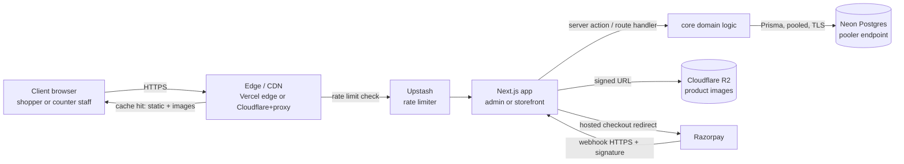
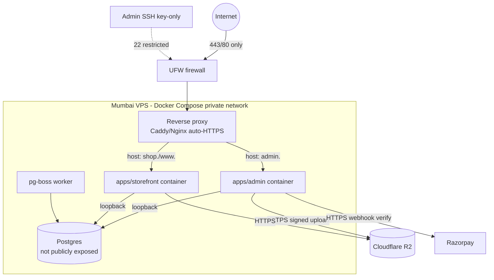
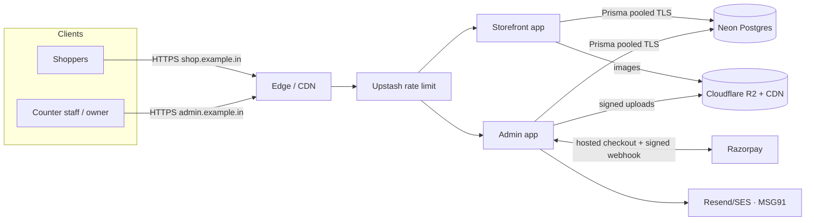

# Network Architecture

**Status:** DRAFT · 2026-06-24
The network shape of the app — public domains, DNS, TLS everywhere, the end-to-end request path, CDN/edge caching, CORS, Razorpay webhook ingress, database connectivity, edge rate limiting, and the locked-down VPS variant.

> Reads alongside `05-infrastructure-architecture.md` (environments, hosting, backups) and `07-security-architecture.md` (auth, headers, payment integrity). This doc covers *how traffic flows and is bounded*; it does not restate the stack (`01-tech-stack.md`) or the deployment topology (`05`).

## Scope

Two public Next.js apps from one Turborepo — `apps/admin` (owner: stock, billing kacha/pakka, ledger) and `apps/storefront` (B2C + B2B catalog, cart, orders) — plus their API route handlers, talking to Neon Postgres, Cloudflare R2, and Razorpay. The network posture differs slightly between the two go-live options in `05`:

- **Option A (Vercel Pro):** edge + serverless functions are managed; TLS, CDN, and DDoS protection are platform-provided.
- **Option B (Mumbai VPS):** a single box behind a reverse proxy; we own the firewall, TLS issuance, and the rule that **Postgres is never publicly reachable**.

Both are described below; differences are called out.

---

## 1. Public domains and subdomains

Exact registrable domain is **TBD** (placeholder `example.in`). Two apps → two hostnames so the admin surface is cleanly separable and independently hardened.

| Host (TBD names) | App | Audience | Notes |
|------------------|-----|----------|-------|
| `www.example.in` / `shop.example.in` | `apps/storefront` | Public B2C + B2B shoppers | SEO-indexed, CDN-cached, highest traffic |
| `admin.example.in` | `apps/admin` | Owner + staff (counter POS) | Not indexed; tighter rate limits + auth gate |
| `api.example.in` *(optional)* | API route handlers | Internal/first-party only | May stay co-located under each app rather than a separate host — **TBD** |

Assumptions (clearly labelled): a single apex `example.in` redirects to `www`; the admin app lives on its **own subdomain** rather than a `/admin` path so cookies, CORS, and rate limits are scoped per host. If a separate `api.` host is not used, API routes are served from each app's own origin (no cross-origin call in the common path).

---

## 2. DNS

- **Registrar / DNS host:** **TBD** (likely Cloudflare DNS — pairs with R2 and gives free proxy/CDN + edge controls).
- **Records:**
  - *Option A:* `CNAME`/`ALIAS` for each app host → Vercel; apex via Vercel's recommended A/ALIAS.
  - *Option B:* `A`/`AAAA` records for app hosts → the **Mumbai VPS** public IP; apex → same.
  - `CNAME` for any R2 public/custom-domain bucket used to serve images (e.g. `img.example.in`).
- **Email auth records** (SPF / DKIM / DMARC) for Resend/SES and MSG91 sending domains — required for deliverability of order/khata notifications (config in `05`/`07`).
- TTLs kept moderate (e.g. 300–3600s) so a go-live cutover or IP change propagates quickly.

---

## 3. TLS everywhere

HTTPS on every public surface; HTTP redirects to HTTPS; HSTS enabled.

| Surface | TLS handling |
|---------|--------------|
| Storefront + admin (Option A) | **Vercel-managed** certificates (auto-provisioned, auto-renewed) |
| Storefront + admin (Option B) | **Caddy** (auto-HTTPS via Let's Encrypt) — or Nginx + certbot — terminating TLS at the reverse proxy |
| R2 image domain | TLS via Cloudflare on the custom domain |
| Neon Postgres | TLS required on the wire (§7) |
| Razorpay APIs/webhooks | HTTPS only (§6) |

Internal hop on the VPS (proxy → app container, app → local Postgres) is over the Docker network / loopback and not exposed publicly; TLS terminates at the proxy. Cipher/HSTS/CSP specifics live in `07-security-architecture.md`.

---

## 4. End-to-end request flow

Path in words: client → **edge/CDN** (TLS termination, static/image cache, DDoS shielding) → **rate-limit gate** (Upstash, §8) → **Next.js app** (SSR / server action / route handler) → **domain logic** → **Neon** over a **pooled, TLS** connection. Images are fetched directly from **R2 + CDN**, not proxied through the app. Payments leave via a **hosted-checkout redirect** to Razorpay and return asynchronously via a **signed webhook** (§6).

---

## 5. CDN / edge caching (storefront)

The storefront is read-heavy and SEO-driven, so it leans on edge caching; the admin app is dynamic/authenticated and largely uncached.

- **Static assets** (JS/CSS bundles, fonts): immutable, hashed filenames → cached at the edge with long max-age.
- **Product images**: served from **R2 + CDN** (custom image domain) with long cache lifetimes; no egress fees from R2 (see `05` §5). Image URLs are stable per asset version.
- **Catalog / product pages**: Next.js **ISR / cache** so popular pages render from cache and revalidate on a schedule or on data change (revalidation triggered from admin writes — mechanism **TBD**).
- **Personalised / B2B-priced views, cart, checkout, all of admin**: **never cached** (per-user, auth-gated) — `Cache-Control: private, no-store`.
- *Option A:* Vercel's edge network handles this. *Option B:* Cloudflare in front of the VPS provides CDN + caching; the reverse proxy sets cache headers and Cloudflare honours them.

---

## 6. Razorpay webhook ingress

Payments use Razorpay **hosted checkout** (no card data on our servers — see `07`). Order state is confirmed by **server-to-server webhooks**, treated as untrusted input until verified.

- **Ingress:** a dedicated route handler, e.g. `POST https://admin.example.in/api/webhooks/razorpay` (or storefront origin — **TBD**), HTTPS only.
- **Signature verification:** every webhook is verified with the **Razorpay webhook secret** (HMAC SHA-256 over the raw body) **before** any processing. Invalid signature → `400`, no side effects. Secret is stored per `05` §6.
- **Idempotency:** handler is idempotent on Razorpay event/payment id so retries (Razorpay re-delivers on non-2xx) never double-apply an order/ledger entry. Ties into the audit/void log.
- **IP considerations:** prefer to verify by **signature, not source IP** (Razorpay does not guarantee a stable static IP allow-list for webhooks). If platform WAF rules are added, allow Razorpay's published ranges but keep signature verification as the authoritative gate.
- **Raw body:** the route must read the **unparsed body** for HMAC — ensure framework body-parsing doesn't mutate it before verification.

Detailed payment integrity (idempotent order finalisation, reconciliation) is in `07-security-architecture.md`.

---

## 7. Database connectivity

- **Endpoint:** Prisma connects to Neon's **pooler endpoint** (PgBouncer-style) on the serverless path to bound connection count; the **direct** endpoint is used only for migrations (`05` §4).
- **TLS:** connections require TLS (`sslmode=require`); the connection string carries SSL params. No plaintext DB traffic.
- **IP allow-listing:** Neon supports **IP allow-lists** on paid tiers — restrict to the platform's egress ranges **where available** (**TBD** at go-live; serverless egress IPs are broad, so this is a defence-in-depth measure, not the primary control). The primary control is credentials + TLS + least-privilege DB role.
- **Option B (VPS):** Postgres runs **inside Docker Compose on the same host** and binds to the **Docker network / `127.0.0.1` only** — it is **not** published to a public port. The app reaches it over the internal network; nothing external can open a Postgres connection. This is the strongest posture and removes the IP-allow-list question entirely.

---

## 8. Rate limiting at the edge (Upstash)

Edge/near-edge rate limiting via **Upstash** (Redis-backed sliding window) protects auth and public endpoints before they reach app logic or the DB.

| Surface | Policy (initial — tune later) | Why |
|---------|-------------------------------|-----|
| **Login / auth endpoints** (admin + storefront) | Strict per-IP + per-account limit; exponential backoff on failures | Credential-stuffing / brute-force defence (complements Auth.js login rate-limiting in `07`) |
| **Password reset / OTP send** | Tight per-account + per-IP cap | Prevent SMS/email abuse + cost (MSG91/Resend) |
| **Public search / catalog API** | Generous per-IP cap | Scraping / abuse protection without hurting real shoppers |
| **Razorpay webhook** | Not user-rate-limited; gated by signature + idempotency (§6) | Must accept legitimate retries |
| **Admin mutations** | Per-session sane ceilings | Backstop against runaway clients |

*Option A:* limiter runs in edge middleware calling Upstash. *Option B:* the reverse proxy can add coarse limits (e.g. Nginx `limit_req`) and the app calls Upstash for fine-grained per-account limits. Specific thresholds are **TBD** and tuned from real traffic.

---

## 9. CORS posture

The design keeps the **common path same-origin** to minimise CORS surface.

- Each app's API route handlers live on the **same origin** as the app (storefront calls storefront routes; admin calls admin routes) → **no CORS preflight** in normal use.
- The two apps (`admin.` and `shop.`) are **separate origins** and do **not** make browser-side cross-origin calls to each other; they share state through the **database and `packages/core`**, server-side, not via cross-origin fetch.
- If a shared `api.example.in` host is introduced (**TBD**), CORS is **default-deny** with an **explicit allow-list** of the two known app origins only, credentials-aware, methods limited to what's used. No wildcard `*` on credentialed endpoints.
- The Razorpay webhook is a server-to-server `POST` (no browser origin) → not a CORS concern; secured by signature (§6).

---

## 10. VPS-variant network (Option B)

For the single Mumbai VPS, the network is deliberately minimal and closed.

- **Firewall (UFW / cloud security group):** **only 80 and 443** open inbound (plus SSH on 22, ideally restricted to known IPs / key-only). Everything else **denied** by default.
- **Reverse proxy** (Caddy or Nginx) is the **only** public listener; it terminates TLS and routes by host → the correct app container.
- **Postgres** binds to **loopback / Docker network only** — **never** a public port; backups read it locally (`05` §7).
- **Containers** talk over the internal Docker network; no app port is published except through the proxy.
- Optional **Cloudflare proxy** in front adds CDN + DDoS + WAF and hides the origin IP.

---

## 11. Consolidated network diagram (logical)

---

## Open items (TBD)
- Exact domain + subdomain names (`example.in` is a placeholder).
- DNS host / whether Cloudflare proxy fronts the apps.
- Whether a dedicated `api.example.in` host exists or routes stay co-located.
- Neon IP allow-list applicability at the chosen go-live tier (Option A).
- Final rate-limit thresholds and ISR revalidation trigger from admin writes.
