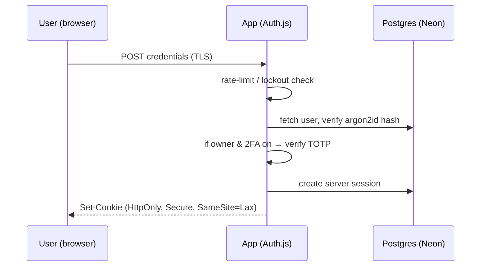
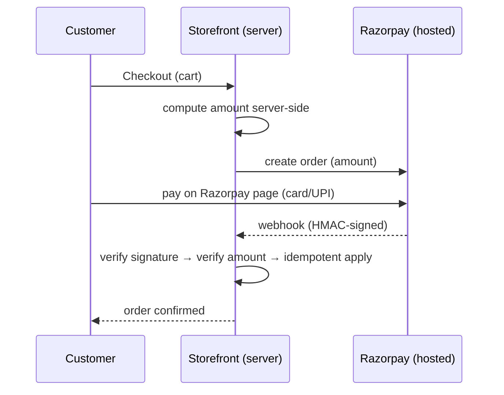

# Security Architecture

**Status:** DRAFT · 2026-06-24
How the hardware-store app protects identities, money, and statutory records — the threats we defend against and the controls that do it.

## Scope & posture

This is a web app for **one GST-registered hardware store** in India (turnover < ₹5 cr). The crown jewels are narrow but valuable: **GST tax invoices (pakka)**, the **khata credit ledger**, **customer PII + GSTINs**, and **payment flows**. We are a modular monolith on a managed platform (see `05-infrastructure-architecture.md`), so the attack surface is small — one auth layer, one database, one set of business rules — and we harden it accordingly.

Guiding rules:
- **Never trust the client.** Every authorization and amount check runs on the server.
- **Minimize what we hold.** No card data ever (Razorpay hosted checkout); least-privilege DB access; log no secrets.
- **Make the money tamper-evident.** Gapless invoice numbering, an append-only audit/void log, encrypted backups.
- **Defence in depth.** TLS + validation + parameterized queries + headers + scanning, not any single wall.

Two facts shape the whole design: there is **one owner/admin login today** (RBAC is built but single-role; see `10-rbac.md`), and **kacha sales leave zero trace** by owner decision — examined honestly in the last section.

---

## 1. Authentication (Auth.js v5, self-hosted)

We self-host **Auth.js (NextAuth) v5** with the **Prisma adapter** and **database session strategy** (server-side sessions, opaque cookie — not a JWT in the browser). Email/password is the only method at v1. The same `@hardware/auth` package configures both apps but they are **separate identity domains**: storefront customers and the owner-admin are different user pools and never share a session.

**Password storage.** Hash with **argon2id** (memory-hard, the OWASP-recommended default). Tune cost to ≥ ~64 MB memory / ≥ 3 iterations and re-tune at go-live on production hardware. Never store or log plaintext. On login, verify and **transparently re-hash** if parameters have since been upgraded.

**Session cookies.** Issued `HttpOnly` + `Secure` + `SameSite=Lax`, with a host-only scope and a sliding expiry (e.g. 30-day max, idle timeout shorter for admin). Server-side sessions mean we can **revoke instantly** (logout-everywhere) by deleting session rows — important since the owner may be logged in on phone and PC at once.

**Email verification.** New customer accounts must verify via a single-use, **expiring token** (hash the token at rest; ~24 h TTL) before they can place credit/khata-linked orders. Email via Resend/MSG91 (see `01-tech-stack.md`).

**Password reset.** Reset link carries a single-use token, **hashed in DB**, short TTL (~30–60 min), invalidated on use or on a newer request. Responses are **enumeration-safe** ("if an account exists, we've emailed you").

**Rate-limiting & lockout.** Throttle login, reset, and verification endpoints **per-IP and per-account** (Upstash rate-limit; see `06-network-architecture.md`). Apply progressive backoff and a temporary lockout after N failed attempts; log lockout events to the application log and surface repeated lockouts as a security alert (see `08-observability-architecture.md`).

**2FA (optional, owner).** Offer **TOTP** (authenticator app) on the owner-admin login — recommended given it guards billing and the ledger. Store the TOTP secret encrypted; issue one-time recovery codes (hashed). Defer enforcement policy and WebAuthn to a later iteration (**TBD**).

---

## 2. Authorization (RBAC — summarized)

Access control is **role-based and enforced server-side**. Today there is effectively one privileged role (**owner-admin**) plus **customer**; the model is built to add staff roles (cashier, accountant) without rework. The **full role/permission matrix and enforcement details live in `10-rbac.md`** — not duplicated here.

Principles enforced in this codebase:
- **Server is the authority.** Every server action, route handler, and API endpoint checks the session and required permission *before* doing work. The client UI hides controls for convenience only; it is never the gate.
- **Two separate gates.** The `apps/admin` surface requires an owner-admin session; `apps/storefront` requires (where needed) a verified customer session. A customer session can never reach admin capabilities.
- **Object-level checks.** A customer may read/modify only **their own** orders and khata entries — ownership is verified on every access, not inferred from a URL or hidden field (prevents IDOR / broken object-level auth).
- **Deny by default.** Unknown/insufficient permission → 403; unauthenticated → redirect/401.

---

## 3. Data protection

**In transit.** **TLS 1.2+ everywhere** (platform-managed certs on Vercel, or Caddy auto-HTTPS on a Mumbai VPS — see `05`/`06`). HSTS on. No plaintext HTTP.

**At rest.** Postgres on **Neon** provides **encryption at rest** for the database; **Cloudflare R2** encrypts stored objects. Application secrets live in the host secret store, not the DB.

**PII & GSTIN handling.** We hold customer name, phone, email, addresses, and (for B2B) **GSTIN**. We **collect the minimum**, validate GSTIN format/checksum on capture (see `03-review-and-gaps.md` P2), and never expose another customer's PII across the object-level checks above. Indian context: GST records (pakka invoices, ledger) carry a **~6-year retention** obligation, so PII tied to invoices is retained as long as the invoice is — it is *not* freely deletable while within the statutory window (reconcile any "delete my data" request against this; policy **TBD** with the owner's accountant).

**Least-privilege DB role.** The application connects as a role that can **read/write business tables but not perform destructive DDL** in production; migrations run under a separate, tightly-scoped migration credential in CI/CD. No shared superuser in the app runtime.

**Backups.** **Automated, encrypted backups** are mandatory (point-in-time where the plan allows). Backups inherit at-rest encryption; restore is rehearsed periodically. Backup scope, schedule, and retention are defined in `05-infrastructure-architecture.md`; they must cover the full **~6-year GST retention** for invoices and ledger.

**Retention summary.**

| Data | Retention | Driver |
|------|-----------|--------|
| Pakka tax invoices, credit notes | **~6 years** | GST statute (India) |
| Khata ledger entries | ~6 years (tied to invoices) | GST / financial integrity |
| Audit / void log | ≥ life of related records | Tamper-evidence |
| Kacha sales | **none** (zero trace) | Owner decision — see §10 |
| Application logs | 30–90 days (TBD) | Ops; see `08` |
| Customer PII | While account active + statutory window | Privacy vs GST retention |

---

## 4. Payment security (Razorpay)

We use **Razorpay hosted checkout**: the customer enters card/UPI details on **Razorpay's** page/SDK, never on our servers or DOM. **We never see, transmit, or store card data**, which keeps our **PCI-DSS scope minimal** (effectively SAQ-A class). This is a deliberate, locked decision.

Controls:
- **Server-side order creation.** The order amount is computed **on the server** from authoritative prices/stock and passed to Razorpay; the client never dictates the amount.
- **Webhook signature verification — mandatory.** Every Razorpay webhook is verified with the **HMAC signature** against the webhook secret before we act on it. Unsigned/invalid → rejected and logged. (Endpoint contract in `04-api-design.md`.)
- **Server-side amount + status verification.** On `payment.captured`, re-verify that the captured amount/currency match the stored order *before* marking it paid or fulfilling.
- **Idempotency.** Webhooks can be delivered more than once. Persist the Razorpay event/payment id and make handlers **idempotent** (upsert on a unique key) so a replay can't double-credit, double-fulfil, or corrupt the ledger.
- **Refunds** go back through Razorpay's API server-side; refund events follow the same verify-then-apply path.

---

## 5. Input validation & query safety

- **Zod at every trust boundary.** Form submissions, server actions, route handlers, webhook payloads, and external responses are parsed/validated with **Zod** before use. Validation lives in `@hardware/core` so client and server share one schema. Reject early; never coerce untrusted input into queries or rendering.
- **Prisma parameterized queries.** All DB access goes through **Prisma**, which parameterizes queries — **no string-built SQL**, so no SQL injection. Any rare raw query uses `$queryRaw` **tagged-template parameterization**, never interpolation.
- **Output encoding.** React escapes by default (XSS); we avoid `dangerouslySetInnerHTML`, and where rich text is unavoidable we sanitize. File uploads to R2 validate type/size and are served from a separate origin.

---

## 6. OWASP Top-10 (2021) — mitigation map

| # | Risk | How we mitigate it here |
|---|------|--------------------------|
| A01 | Broken Access Control | Server-side RBAC + object-level ownership checks; deny-by-default; admin/storefront split (`10-rbac.md`). |
| A02 | Cryptographic Failures | TLS 1.2+ in transit; Neon/R2 encryption at rest; argon2id passwords; tokens hashed at rest. |
| A03 | Injection | Zod validation + Prisma parameterized queries; React output escaping. |
| A04 | Insecure Design | Modular monolith, threat model (below), least-privilege, tamper-evident audit log. |
| A05 | Security Misconfiguration | Security headers + CSP; secrets in host store; prod DB role least-privilege; no debug in prod. |
| A06 | Vulnerable / Outdated Components | Dependabot + `npm audit` in CI; pinned versions (`01-tech-stack.md`); fail build on high severity. |
| A07 | Identification & Auth Failures | Auth.js v5, rate-limit/lockout, email verification, expiring reset tokens, optional TOTP. |
| A08 | Software & Data Integrity Failures | Signed Razorpay webhooks; idempotent handlers; gapless invoice numbering; CI provenance. |
| A09 | Logging & Monitoring Failures | Structured logs, Sentry, alerting, audit log — see `08-observability-architecture.md`. |
| A10 | Server-Side Request Forgery | No user-supplied URLs fetched server-side; all-list any outbound integration hosts. |

---

## 7. Secrets management

- Secrets (DB URL, Auth.js secret, Razorpay keys + webhook secret, R2 keys, Resend/MSG91 keys) live in the **platform secret store / environment** — **never in the repo**, never in client bundles. Only `NEXT_PUBLIC_*` values reach the browser, and those hold nothing sensitive.
- **Per-environment** secrets (dev/staging/prod) with no sharing; production secrets accessible only to the deploy pipeline and owner.
- **Rotation** on suspected exposure or staff change; Auth.js secret rotation invalidates sessions (planned, low-frequency). Rotation runbook **TBD** in `05`.

---

## 8. Security headers, CSP & CSRF

- **Headers** (set at the app/edge): `Strict-Transport-Security`, `X-Content-Type-Options: nosniff`, `X-Frame-Options: DENY` (clickjacking), `Referrer-Policy: strict-origin-when-cross-origin`, a restrictive `Permissions-Policy`, and a **Content-Security-Policy**.
- **CSP** is allow-list based: `default-src 'self'`, scripts/styles from self + the **Razorpay checkout** origin, images from self + R2, `frame-ancestors 'none'`. Tighten nonces/hashes during build-out (**TBD** final policy).
- **CSRF.** State-changing operations use **Next.js Server Actions** (origin-checked, not classic form-replayable) and `SameSite=Lax` session cookies; any custom mutating route handler additionally checks **Origin/Referer** and uses a CSRF token where a server action isn't used. Auth.js endpoints carry their own CSRF protection.

---

## 9. Dependency & secret scanning in CI

GitHub Actions (see `01-tech-stack.md`, `05`) enforces, on every PR:
- **Dependabot** — automated dependency-update PRs; security advisories surfaced.
- **`npm audit`** (or `pnpm audit`) — **fail the build on high/critical** advisories; triage moderate.
- **gitleaks** — scan the diff (and history on a schedule) for **committed secrets**; block the merge on a hit.
- Lint/type-check/test gates must pass before merge; Docker base images are pinned and rebuilt for patches.

---

## 10. Threat model (concise)

**Key assets:** ① pakka invoices + gapless numbering, ② khata ledger (money owed), ③ customer PII + GSTIN, ④ payment flow / order integrity, ⑤ the owner-admin account itself.

| Threat (STRIDE-ish) | Asset | Mitigation |
|---------------------|-------|------------|
| Account takeover of owner-admin | All | argon2id, rate-limit/lockout, optional TOTP, server sessions revocable, alerts on repeated lockouts. |
| Customer credential stuffing | PII, orders | Per-account + per-IP throttling, enumeration-safe flows, breach-conscious password policy. |
| IDOR — read/edit another's order or khata | PII, ledger | Object-level ownership checks on every access (§2). |
| Payment tampering (amount/replay) | Payments | Server-side amount calc, signed webhooks, idempotent handlers (§4). |
| Invoice tampering / fake voids | Invoices, ledger | Gapless numbering (no deletes — cancel/credit-note only), **append-only audit/void log** capturing who/what/when. |
| SQL injection / XSS | All | Prisma parameterization + Zod + React escaping (§5). |
| Secret leakage in repo/logs | All | gitleaks in CI, secrets in host store, log redaction (`08`). |
| Data loss / ransomware | Invoices, ledger | Automated **encrypted backups**, rehearsed restore, ~6-yr retention (§3, `05`). |
| Repudiation ("I never made that sale/edit") | Invoices, ledger | Audit/void log + immutable invoice numbering — **except kacha, see below**. |
| Vulnerable dependency | All | Dependabot + audit + pinned versions (§9). |

**Audit/void log.** Financially significant actions — void/cancel an invoice, issue a credit note, edit a price/rate override, adjust the khata, change a paid status — are written to an **append-only, tamper-evident audit log in the database** (who, what, before/after, when). This is the integrity backbone the requirements review flagged as a must-have (`03-review-and-gaps.md` P1-11). It is a **business record**, distinct from application/diagnostic logs — that distinction is detailed in `08-observability-architecture.md`.

---

## 11. Kacha zero-trace — security & repudiation tradeoff (explicit)

The owner's locked decision: **a kacha sale decrements stock and saves nothing else** — no bill, no line items, no customer, no amount. We honour it, and we state the consequence plainly:

- **No audit trail exists for kacha sales.** They are, by design, **fully repudiable** — the system cannot later prove a given kacha sale happened, who made it, or for how much. There is **no record to detect tampering, fraud, or internal theft** against, and **no record to handle a kacha return**.
- **Reconciliation gap.** Because nothing is stored, kacha cash and the kacha stock drop cannot be explained at day-end; that stock can read as **shrinkage** in reports (the exact risk in `03-review-and-gaps.md` P0-1).
- **This is an accepted business risk, owned by the shop owner**, not a defect. Security controls here are limited to what *can* be protected without keeping a record: the **stock decrement itself** is an authenticated, authorized action and *that* movement may be **tagged "kacha"** (count/value only, no item or party) so genuine shrinkage is distinguishable — **only if and when the owner permits even a minimal aggregate**. If zero-trace is absolute, even that tag is omitted and the reconciliation gap stands.
- **Recommendation (non-binding):** adopt the minimal tagged-aggregate compromise from the requirements review to recover reconciliation and theft-detection without storing kacha history. Decision rests with the owner.

Everything statutory — **pakka** invoices, credit notes, the khata ledger — is fully recorded, numbered, audited, and retained. The zero-trace property is **scoped to kacha alone**.

---

### Cross-references
- `08-observability-architecture.md` — logging redaction, Sentry, alerting, audit-log vs app-log distinction.
- `10-rbac.md` — full role/permission matrix and enforcement.
- `05-infrastructure-architecture.md` — backups, secrets store, environments, CI/CD.
- `06-network-architecture.md` — TLS, DNS, rate limiting, CORS.
- `03-review-and-gaps.md` — origin of audit-log, backup, and kacha-reconciliation requirements.
