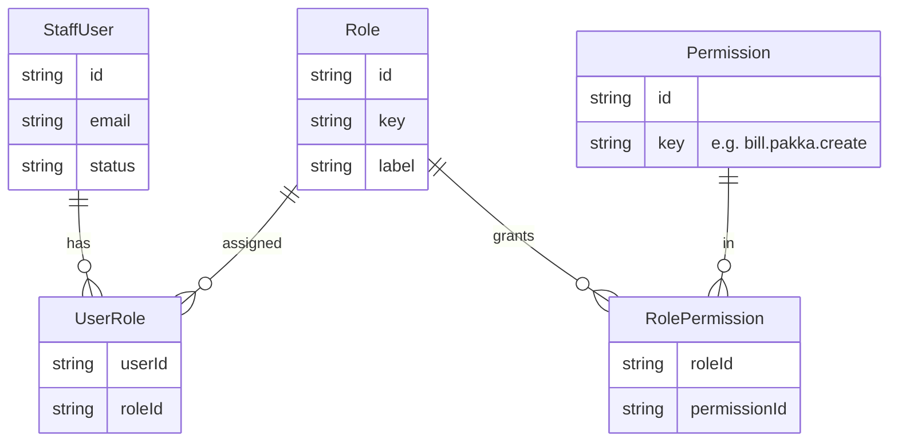
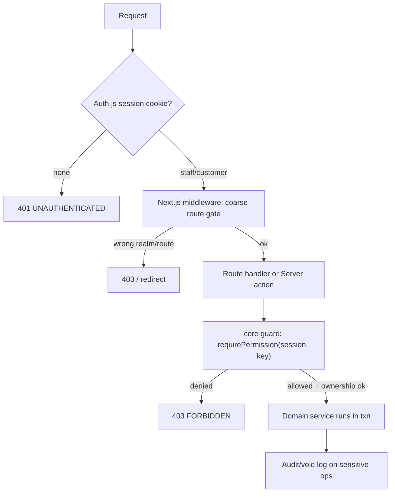

# RBAC — Roles, Permissions & Enforcement

**Status:** DRAFT · 2026-06-24
The role model, the permission matrix, and how authorization is enforced — built for a single owner today but designed so cashier/stock-manager/accountant roles drop in later without schema churn.

> Scope note: this doc owns the **role model and permission matrix**. The mechanics of sessions/cookies, password hashing, 2FA, CSRF and payment security live in `07-security-architecture.md`; the endpoint-to-permission mapping lives in `04-api-design.md`; the audit/void log structure lives in `03-technical-architecture.md`. This doc references those rather than restating them.

---

## 1. Principle: least privilege, server-enforced, future-proof

Three commitments shape everything below:

1. **Least privilege.** Every principal gets exactly the permissions their job needs and no more. The Owner is the exception (all permissions) because v1 has one staff user — but the *model* still expresses Owner as "holds all permissions", not as "skip the check".
2. **Server-side enforcement only — never trust the client.** The UI hides buttons a role can't use, but that is cosmetic. Every mutation re-checks permission in `@hardware/core` against the **session**, server-side. A hidden button is not a security control.
3. **Add roles without schema churn.** v1 ships one staff role, but the **role→permissions mapping lives in data, not code**. Introducing Cashier later is an INSERT, not a migration + redeploy of business logic.

---

## 2. Roles

### 2.1 v1 roles (shipping now)

| Role | Realm | Auth surface | Purpose |
|------|-------|--------------|---------|
| **Owner / Admin** | Staff | `apps/admin` | The single management + billing login. Holds **all** staff permissions: catalog, stock, GRN, suppliers, pricing, both bill types, ledger, orders, reports, settings. |
| **Customer** | Storefront | `apps/storefront` | Self-service shopper account (B2C + B2B). Can browse, cart, checkout, view **their own** orders/ledger. **Cannot** touch any admin/staff capability. |

This matches the locked decision: *single owner/admin login now; separate customer accounts for the storefront; structured so staff roles can be added later.*

### 2.2 Future staff roles (model must accommodate — NOT enabled in v1)

These are **designed-for** but **not activated** in v1. They exist in this doc and in the permission matrix so the data model and code guards are shaped correctly from day one. Activating them later = creating the role rows + their permission mappings (see §6).

| Future role | Intended scope (illustrative — **TBD** at activation) |
|-------------|-------------------------------------------------------|
| **Cashier** | Counter billing: create kacha + pakka, take payments, record part-payments. **No** product/price edits, **no** cancel/credit-note (or only with override), **no** reports/settings, **no** supplier/GRN. |
| **Stock Manager** | Catalog + stock: products, units, GRN, adjustments, returns, suppliers, pricing, import. **No** billing, **no** ledger writes, **no** financial reports/settings. |
| **Accountant** | Read financials + file GST: read bills/ledger, **create credit notes**, run/export reports incl. **GSTR-1**. **No** stock-in, **no** product edits, **no** settings. |

> Per-role permission sets above are **starting proposals**, marked **TBD** until the owner activates roles. The matrix in §4 encodes a sensible default; it is data and can be tuned per deployment without code changes.

### 2.3 Realm separation (staff vs customer) — hard boundary

Staff and customers are **different account tables, different Auth.js providers, different cookie scopes** (see `04-api-design.md` §3 and `07-security-architecture.md`). A customer session can **never** be elevated to any staff permission, and staff accounts never sign in through the storefront. RBAC permissions in §4 govern **staff** roles; the Customer role is a separate axis whose permissions are intrinsically "own-resource only" (place own order, view own ledger) and are enforced by **ownership checks**, not the staff matrix.

---

## 3. Model: permissions, roles, mapping

Authorization is **permission-based**, not role-name-based. Code guards check `can(session, 'bill.pakka.create')`, never `if (role === 'OWNER')`. Roles are just **named bundles of permissions**.

- **`Permission`** — one row per atomic capability (`products.create`, `stock.adjust`, …). Seeded from code; stable string `key`.
- **`Role`** — `OWNER` in v1; `CASHIER`/`STOCK_MANAGER`/`ACCOUNTANT` added later. Just a label + key.
- **`RolePermission`** — the join that *is* the policy. Editing this table re-shapes a role. This is the "no schema churn" hinge.
- **`UserRole`** — a staff user can hold one or more roles (v1: the single owner holds `OWNER`). Multiple roles = union of permissions.
- **Customer** accounts live in their **own** table, outside this graph (§2.3).

Permission keys are namespaced `resource.action` (`.own` suffix = ownership-scoped, e.g. `orders.cancel.own`). The complete key list is the row set of §4.

---

## 4. Permission matrix

Rows = permission keys (resource.action). Columns = roles. `✓` = granted, `—` = denied. **Owner = all ✓** by definition. Future-role columns show the **proposed default** (TBD until activated). Customer is shown only for the few self-service, ownership-scoped permissions; everything not listed for Customer is denied.

| Permission key | Owner | Cashier _(future)_ | Stock Mgr _(future)_ | Accountant _(future)_ | Customer |
|---|:---:|:---:|:---:|:---:|:---:|
| `products.read` | ✓ | ✓ | ✓ | ✓ | ✓ (storefront fields) |
| `products.create` | ✓ | — | ✓ | — | — |
| `products.update` | ✓ | — | ✓ | — | — |
| `products.archive` | ✓ | — | ✓ | — | — |
| `units.manage` | ✓ | — | ✓ | — | — |
| `pricing.read` | ✓ | ✓ | ✓ | ✓ | ✓ (bulk slabs) |
| `pricing.write` | ✓ | — | ✓ | — | — |
| `stock.read` | ✓ | ✓ | ✓ | ✓ | — (sees live status only) |
| `stock.grn` | ✓ | — | ✓ | — | — |
| `stock.adjust` | ✓ | — | ✓ | — | — |
| `stock.returns` | ✓ | — | ✓ | — | — |
| `suppliers.read` | ✓ | — | ✓ | ✓ | — |
| `suppliers.write` | ✓ | — | ✓ | — | — |
| `bill.kacha.create` | ✓ | ✓ | — | — | — |
| `bill.pakka.create` | ✓ | ✓ | — | — | — |
| `bill.read` | ✓ | ✓ | — | ✓ | — |
| `bill.cancel` | ✓ | — | — | — | — |
| `bill.creditnote.create` | ✓ | — | — | ✓ | — |
| `customers.read` | ✓ | ✓ | — | ✓ | — |
| `customers.write` | ✓ | ✓ | — | — | — |
| `ledger.read` | ✓ | ✓ | — | ✓ | ✓ (own only) |
| `ledger.write` | ✓ | ✓ | — | — | — |
| `orders.read` | ✓ | ✓ | ✓ | ✓ | ✓ (own only) |
| `orders.fulfil` | ✓ | — | ✓ | — | — |
| `orders.place` | — | — | — | — | ✓ |
| `orders.cancel.own` | — | — | — | — | ✓ |
| `import.catalog` | ✓ | — | ✓ | — | — |
| `reports.read` | ✓ | — | — | ✓ | — |
| `reports.export` (GSTR-1/HSN) | ✓ | — | — | ✓ | — |
| `settings.read` | ✓ | — | — | — | — |
| `settings.write` | ✓ | — | — | — | — |
| `users.manage` (assign roles) | ✓ | — | — | — | — |
| `audit.read` | ✓ | — | — | ✓ | — |

Notes on deliberate choices:

- **`bill.cancel` = Owner-only** even in the future model. Cancelling a gapless tax invoice is a high-trust act; default-deny it to Cashier. Accountant gets **credit-note** (the compliant correction path) instead of cancel.
- **`bill.kacha.create`** is granted to Cashier but **not** Stock Manager/Accountant — kacha is a counter act. Remember: kacha persists **no bill** (only a stock decrement), so this permission gates the *stock-out action*, audited as unattributed (see `04-api-design.md` §7, `03-technical-architecture.md`).
- **`ledger.read` for Customer is ownership-scoped** (`.own`) — a B2B customer sees only their own khata/outstanding, enforced by an ownership check, never the staff matrix.
- **`orders.place` / `orders.cancel.own`** belong **only** to Customer; staff don't place storefront orders. Staff move orders via `orders.fulfil`.
- **`reports.export`** (GSTR-1 + HSN summary) is the accountant's reason to exist; Owner has it too.
- **Manual rate override at billing** is part of `bill.pakka.create`/`bill.kacha.create` in v1 (Owner). When Cashier is activated, an optional **floor/override permission** (`bill.line.override`, **TBD**) can split that out so bargaining is allowed but below-floor needs Owner — matching the proposal's "optional floor/permission".

---

## 5. Enforcement

Defense in layers; the deepest layer is authoritative.

1. **Auth.js session (cookie)** — establishes *who* and *which realm* (staff vs customer). No session → `401`. Detail: `07-security-architecture.md`.
2. **Next.js middleware** — **coarse** gating only: `apps/admin/**` requires a staff session and redirects/blocks customers; `apps/storefront` account routes require a customer session. Middleware is a fast first filter, **not** the permission check.
3. **Server-side permission guard in `@hardware/core`** — the **real** check. Every mutation calls `requirePermission(session, 'resource.action')`, which resolves the session's roles → permission set (cached per request) and throws `FORBIDDEN` (`403`) if absent. This runs **identically** whether the entry point is a route handler or a server action (both share the core service — see `04-api-design.md` §1), so there is no bypass path.
4. **Ownership checks** for `.own` permissions — even with `orders.read`, a customer fetching `orders/{id}` must own it, or `404`/`403`. Ownership is checked in the service, not inferable from the role alone.
5. **Client UI** — hides/disables controls the role lacks. **Cosmetic only.** Never the gate.

**Why both middleware and core guard:** middleware can't see fine-grained, data-dependent permissions cheaply (and runs in a limited edge runtime); the core guard can't gate static asset/route access as early. Together: cheap coarse filter + authoritative fine check. **Never trust the client** is satisfied because step 3 always runs server-side regardless of what the client sent or rendered.

---

## 6. Adding a role later (no schema churn)

The whole point of §3's mapping table. To activate **Cashier**:

1. **Insert** a `Role` row `{ key: 'CASHIER', label: 'Cashier' }`.
2. **Insert** `RolePermission` rows linking it to the granted permission keys (from §4's Cashier column, tuned as desired).
3. **Assign** via `UserRole` when creating/inviting the cashier staff user (gated by `users.manage`, Owner-only).

No Prisma migration, no redeploy of business logic, no change to the guard code — guards already check **permissions**, not role names. New *permissions* (e.g. `bill.line.override`) are the only thing that touch code: add the key, seed the `Permission` row, reference it in the relevant guard. That is additive and rare.

This is why v1 code must **never** branch on `role === 'OWNER'`. It always asks `can(session, key)`. The single owner simply holds every permission today.

**Bootstrap:** a seed creates the `OWNER` role mapped to all permissions and assigns it to the first staff user. Permission `key`s are the source of truth, seeded from a constant in `@hardware/core` so code and DB never drift.

---

## 7. Linkage to audit / void log

RBAC and the audit trail are complementary: RBAC decides *whether* an action is allowed; the audit log records *that it happened and by whom*. Required for financial integrity even with one user (locked decision). Structure: `03-technical-architecture.md`.

Every **sensitive / financial** action writes an audit entry capturing `actorUserId`, `roleAtTime`, `permissionUsed`, `action`, `targetId`, `before`/`after` (where applicable), `requestId`, `timestamp`. Minimum set of audited actions:

- `bill.pakka.create`, `bill.cancel`, `bill.creditnote.create` — invoice lifecycle (gapless, no deletes → cancel/credit-note are the only corrections, and both are logged).
- `stock.adjust`, `stock.returns`, `stock.grn` — and the **kacha stock decrement** (logged as an **unattributed stock-out**; by zero-trace design it carries **no bill/customer/value**, only the movement + actor).
- `ledger.write` (khata receipts), `pricing.write`, `products.*`.
- `users.manage` and any role/permission change — so privilege changes are themselves auditable.
- Auth events (login, failed login, password reset) — see `07-security-architecture.md`.

`audit.read` (Owner, and Accountant when activated) exposes this log; it is **append-only** (no edit/delete), matching the "no deletes" stance.

---

## 8. Open items (TBD)

- **Exact permission sets** for Cashier / Stock Manager / Accountant at activation — §4 is a sensible default, tunable per deployment via `RolePermission`.
- **`bill.line.override` floor permission** — split below-floor rate overrides from normal bargaining once Cashier exists.
- **2FA requirement** scope (Owner login at minimum) — owned by `07-security-architecture.md`.
- Whether future roles need **per-store scoping** — out of scope while single-store (multi-store is a future feature in the proposal); the `UserRole` join can gain a `storeId` then without reshaping the permission model.
- **Granularity of `settings.*`** (single toggle vs sub-resources) as settings surface grows.
