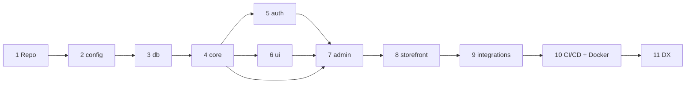

# Scaffolding Plan

**Status:** DRAFT · 2026-06-24 · **Round 2 — review fixes applied** (`12-scaffolding-plan-review.md`)
The build order that turns the architecture into a running, empty-but-wired project. Each phase has a **goal**, **steps/commands**, **files created**, and a **gate** (how you know it's done). Grounded in `01-tech-stack.md`, `03-technical-architecture.md`, `05-infrastructure-architecture.md`, `07-security-architecture.md`, `08-observability-architecture.md`, and `10-rbac.md`.

> Scope: this scaffolds the **skeleton + one thin vertical slice** that proves every layer is wired (UI → server action → core service → Prisma → Neon), plus the **security/RBAC/observability foundation** the arch docs assume from day one. It builds **no business features** — those come after, against this frame. The full Prisma schema is grown starting in Phase 3 (see the data-model note at the end).

---

## Ground rules (carried from the arch docs)
- **pnpm + Turborepo**; Node current LTS (pinned via `.nvmrc`); TypeScript `strict`.
- **Import boundaries are law** (`03 §1`): apps **never** import `packages/db`; only `packages/core` imports the Prisma client; `packages/core` has **no React/Next** imports. Enforced by ESLint (Phase 2).
- **Mutations = server actions; webhooks/cron/REST = route handlers** (`03 §2`). Both call the **same `packages/core` service**.
- **`Decimal` for all money/qty**; serialized across server actions/RSC via **superjson** or as integer **paise** (Decimal isn't JSON-safe) (`03 A1`, `04`).
- **Transactions live in core services**, never in UI/transport (`03 §2`).
- **Authorization is permission-based + server-enforced** (`10 §3/§6`): guards check `can(session, 'resource.action')` — **never** `role === 'OWNER'`; role→permission mapping lives in data.
- **Staff and customers are separate realms** (`10 §2.3`, `07 §1`): different user tables, Auth.js configs, and cookies; a customer session can never reach admin.
- Pooled DB URL for the app, **direct URL for migrations**; the app connects as a **non-DDL least-privilege role**, migrations use a separate credential (`05 §4`, `07 §3`).
- **Workspace packages set `transpilePackages` in Next; `prisma generate` runs before app build** in the Turbo pipeline.
- **Sensitive actions write the append-only audit log; app logs are structured JSON + redacted** (`07 §10`, `08 §1`).

## Prerequisites
| Need | Now? | Notes |
|------|------|-------|
| Node LTS + **pnpm** + git | ✅ | `corepack enable` to get pnpm |
| Docker | ✅ | local Postgres for integration tests; Option-B image |
| **GitHub** repo | ✅ | CI + branch protection |
| **Neon** account | ✅ | free project + dev branch; pooled + direct URLs |
| **Vercel** account | ✅ (dev) | Hobby for previews; Pro only at go-live |
| **Upstash** (Redis + QStash) | 5 / 9 | rate-limit store (5) + jobs queue (9) |
| **Cloudflare R2** | 9 | product images + backup target |
| **Razorpay** (test mode) | 9 | test keys + webhook secret |
| **Resend** / MSG91 | 9 / later | email now, SMS later |
| **Sentry** | 7 | error tracking DSN |
| **Playwright** · **gitleaks** | 7 / 10 | e2e smoke · secret scanning |

---

## Phase map
| # | Phase | Output | Gate |
|---|-------|--------|------|
| 1 | Repo & workspace foundation | Turborepo skeleton + `generate` pipeline wiring | `pnpm install` + `pnpm turbo build` run clean |
| 2 | `packages/config` | shared tsconfig/eslint/tailwind + boundary rules | `pnpm lint` works; boundary rule trips on a bad import |
| 3 | `packages/db` | Prisma + Neon + first migration (**realm-split auth + RBAC + audit + UoM core**) | `prisma migrate dev` + `generate` succeed; test query returns |
| 4 | `packages/core` | domain skeletons + primitives + **permission guard + logger + audit()** | typecheck; UoM/tax/rbac unit tests **+ integration tests (Dockerised PG)** green |
| 5 | `packages/auth` | **realm-separated** Auth.js (admin + customer) + **verify/reset + rate-limit** | typecheck; admin route rejects a customer session; lockout trips |
| 6 | `packages/ui` | shadcn/ui base + Tailwind preset | builds; sample component renders |
| 7 | `apps/admin` | Next.js admin, wired (`transpilePackages`), login + 1 real page, **headers/CSP** | owner logs in; dashboard reads DB via core; **e2e smoke passes** |
| 8 | `apps/storefront` | Next.js storefront, wired, customer realm | customer register/verify/login; catalog lists |
| 9 | Integrations | Razorpay/R2/email/jobs clients + stubs | webhook verifies + idempotent; presigned upload works |
| 10 | CI/CD + Docker | GitHub Actions (**+ Dockerised PG, security scans**) + Dockerfiles | CI green incl. **integration/e2e + audit/gitleaks**; preview deploy live |
| 11 | Dev experience | seed (**owner + RBAC**), scripts, env example, README | fresh clone → `pnpm i && db:migrate && db:seed && dev` runs both apps |



---

## Phase 1 — Repo & workspace foundation
**Goal:** an installable, empty Turborepo with the `03 §1` layout.

Steps:
- `git init`; add `.gitignore`, `.nvmrc`, `.npmrc`, `LICENSE`, root `README.md`.
- `pnpm dlx create-turbo@latest` (or hand-roll): root `package.json` with `"packageManager": "pnpm@…"`, `pnpm-workspace.yaml` (`apps/*`, `packages/*`), `turbo.json` pipeline (`dev`, `build`, `lint`, `typecheck`, `test`, `test:e2e`, `db:generate`, `db:migrate`). **Wire `build` with `dependsOn: ["^db:generate"]`** so the Prisma client is generated before any app builds.
- Create empty `apps/` and `packages/` directories.

Files: `package.json`, `pnpm-workspace.yaml`, `turbo.json`, `.gitignore`, `.nvmrc`, `.npmrc`, `README.md`.

**Gate:** `pnpm install` succeeds; `pnpm turbo run build` is a clean no-op.

## Phase 2 — `packages/config` (shared presets + boundary rules)
**Goal:** one place for TS/ESLint/Tailwind config — and the **import-boundary** rules from `03 §1` mechanically enforced.

Steps:
- `tsconfig.base.json` (strict, paths), per-target presets (`next`, `node-lib`).
- ESLint flat config + `eslint-plugin-boundaries`: **apps cannot import `@hardware/db`**, `core` cannot import `react`/`next`, no app imports the other app.
- Prettier + Tailwind preset (tokens, shadcn theme).

Files: `packages/config/{package.json,tsconfig.base.json,eslint.config.mjs,tailwind.preset.ts,prettier.config.mjs}`.

**Gate:** `pnpm lint` runs; importing `@hardware/db` from an app **fails lint**.

## Phase 3 — `packages/db` (Prisma + Neon)
**Goal:** the single source of truth — schema, client, first migration. The initial migration is deliberately broader than "auth + UoM" so the **security/RBAC/audit foundation exists from day one** (`12-scaffolding-plan-review.md` P0-2/3/4).

Steps:
- `pnpm add -D prisma`, `pnpm add @prisma/client`; `npx prisma init`.
- `schema.prisma`: `datasource` = `env("DATABASE_URL")` (Neon **pooled**) + `directUrl = env("DIRECT_URL")` (unpooled, migrations) per `05 §4`; `generator client`.
- Enable `pg_trgm` via a migration (`03 §11`).
- **Initial models:**
  - **Auth — realm-separated** (`10 §2.3`, `07 §1`): **`StaffUser`** + Auth.js tables for the admin realm, and a **separate `Customer`** (+ Account/Session) for the storefront realm — distinct tables, never shared.
  - **RBAC** (`10 §3`): `Permission{key}`, `Role{key,label}`, `RolePermission`, `UserRole` — data-driven mapping (no role enum on the user).
  - **Audit** (`07 §10`, `10 §7`): append-only `AuditLog{actorUserId, roleAtTime, permissionUsed, action, targetId, before, after, requestId, ts}`.
  - **Auth tokens** (`07 §1`): `VerificationToken` + `PasswordResetToken` (hashed, TTL); `TotpSecret` (+ hashed recovery codes) scaffolded but disabled.
  - **UoM core** (`03 §4,§5,§7`): `Unit{code,kind}`, `Product{baseUnitId,hsn,costPerBaseUnit}`, `ProductSaleUnit{factorToBase:Decimal,pricePerSaleUnit,isDefault}`, `ProductStock{on_hand,reserved}`, `StockMovement{baseQty,kind}`, `InvoiceCounter{fy,last_no}`. Money/qty = `Decimal`.
- **Schema growth (later phases, sequenced now):** `Reservation` (`03 §5`, Phase 9/orders), `ProcessedWebhook` (`03 §9`, Phase 9), then billing/tax/credit-note/khata/order tables in the data-model pass.
- **Least-privilege roles** (`07 §3`): an app role (DML only, no DDL) for `DATABASE_URL`; a separate privileged role for migrations (CI).
- `npx prisma migrate dev --name init`; `prisma generate`; export a singleton `prisma` client + re-export `Prisma.Decimal`.

Files: `packages/db/{package.json,prisma/schema.prisma,prisma/migrations/*,src/client.ts,src/index.ts}`.

**Gate:** migration applies to the Neon dev branch; a throwaway script reads/writes a `Unit` row and inserts an `AuditLog` row.

## Phase 4 — `packages/core` (domain)
**Goal:** plain-TS domain layer with module folders, the load-bearing primitives, and the **cross-cutting guard / logger / audit** (`03 §3–§11`, `07`, `08`, `10`). Depends only on `db` + `config`.

Steps:
- Module folders, each `service.ts` (typed stubs): `catalog/`, `pricing/`, `inventory/`, `billing/`, `ledger/`, `orders/`, `reports/`.
- `shared/`:
  - `errors.ts` (`InsufficientStock`, `Forbidden`, …), `money.ts` (paise⇆Decimal + the **superjson serialization** convention for the transport boundary), `uom.ts` (`baseQty = saleQty × factorToBase`, piece-integer guard), `tax.ts` (place-of-supply + GST rounding skeleton), `result.ts`, `types.ts`.
  - **`rbac.ts`** (`10 §3/§5`): the permission-key **constant** (source of truth) + `can(session, key)` / `requirePermission(session, key)` resolving roles→permissions per request. **No `requireRole`.**
  - **`audit.ts`** (`07 §10`): append-only `audit(tx, entry)` that sensitive services call **inside their transaction**.
  - **`logger.ts`** (`08 §1`): structured JSON logger with **correlation/request id** + a **redaction never-log list** (password, token, cookie, gstin, phone, email, card…); reused by both apps + Sentry `beforeSend`.
- Inventory `decrementStock(tx, …)` and Billing `nextInvoiceNo(tx, fy)` as real implementations of the atomic patterns (`03 §5,§7`) — the riskiest code, done now.
- **Tests** (`vitest`): unit for `uom`/`tax`/`rbac`; **integration against a Dockerised Postgres** (`docker-compose.test.yml`) for `decrementStock` (race/oversell) and `nextInvoiceNo` (gapless under concurrency) — these can't be mocked.

Files: `packages/core/src/{<module>/service.ts, shared/{errors,money,uom,tax,rbac,audit,logger,result,types}.ts, index.ts}`, `vitest.config.ts`, `docker-compose.test.yml`.

**Gate:** `pnpm typecheck` clean; `uom`/`tax`/`rbac` unit tests **and** the Postgres integration tests pass.

## Phase 5 — `packages/auth` (Auth.js v5, realm-separated)
**Goal:** **two** authentication realms — admin (`StaffUser`) and storefront (`Customer`) — sharing helpers but **never a session** (`10 §2.3`, `07 §1`).

Steps:
- `pnpm add next-auth@beta @auth/prisma-adapter argon2 @upstash/ratelimit @upstash/redis`.
- **Two configs** — `staff.config.ts` and `customer.config.ts`: each a Credentials provider (argon2id verify) on its own user table, **distinct cookie names/scopes**, database session strategy. Session carries `userId` + realm; **permissions resolve in `core` (`requirePermission`)**, not a stored role flag.
- **Email verification + password reset**: single-use **hashed, expiring** tokens, enumeration-safe responses, verify-before-credit-order (`07 §1`).
- **Rate-limit/lockout** wrapper (`@upstash/ratelimit`) for login/reset/verify — per-IP + per-account (`07 §1`, `06`).
- Helpers: `getStaffSession()` / `getCustomerSession()`, `hashPassword()/verifyPassword()`. **TOTP** (`TotpSecret`) scaffolded, enforcement deferred (`07 §1`).
- Env: `AUTH_SECRET`, `UPSTASH_REDIS_*`.

Files: `packages/auth/src/{staff.config.ts,customer.config.ts,password.ts,tokens.ts,ratelimit.ts,index.ts}`.

**Gate:** typecheck; a protected admin route rejects a customer session; rate-limit trips after N bad logins.

## Phase 6 — `packages/ui` (shadcn/ui)
**Goal:** shared component library + Tailwind preset from `config`.

Steps:
- `npx shadcn@latest init` (tokens from the `config` preset); add base components (Button, Input, Form, Table, Dialog, Toast).
- Export components + `cn()`; consume the Tailwind preset.

Files: `packages/ui/src/components/*`, `packages/ui/src/index.ts`, `components.json`.

**Gate:** package builds; a Button renders inside an app (Phase 7).

## Phase 7 — `apps/admin` (Next.js, the vertical slice)
**Goal:** prove the whole stack with the owner-facing app — including the security + observability wiring.

Steps:
- `pnpm create next-app apps/admin` (App Router, TS, Tailwind, ESLint); Tailwind → `config` preset + `@hardware/ui`.
- Add workspace deps and set **`transpilePackages: ['@hardware/core','@hardware/auth','@hardware/ui']`** in `next.config` (required for monorepo imports).
- **Security headers + CSP** in `next.config`/middleware (`07 §8`): HSTS, `X-Frame-Options: DENY`, nosniff, Referrer/Permissions-Policy, a starter CSP (self + Razorpay checkout + R2). Note the server-action CSRF posture.
- **Env validation**: `env.ts` with Zod — fail fast at boot.
- **Request-id + logger middleware** (`08 §1`): correlation id per request → logs + Sentry.
- Admin-realm Auth.js handler + **middleware** (coarse gate: staff session for `(admin)`); `(auth)/login`. Mutations/pages call **`requirePermission(session, key)`** from core (`10 §5`) — never role checks.
- **One real page**: `(admin)/dashboard` calls `core.catalog.listProducts()` (server component → core → db) to prove the slice end-to-end.
- `app/api/healthz` + `app/api/readyz` (`08 §7`); Sentry init with `beforeSend` redaction + source maps.
- **Playwright** e2e smoke: login → dashboard renders seeded products.

Files: `apps/admin/{next.config.ts, app/**, env.ts, middleware.ts, sentry.*.ts, e2e/*}`.

**Gate:** `pnpm dev` → admin boots; seeded owner logs in; dashboard shows products **through core from Neon**; a customer session is rejected; `/healthz` 200; **Playwright smoke passes**.

## Phase 8 — `apps/storefront` (Next.js)
**Goal:** customer-facing app on the same packages, customer realm.

Steps:
- `pnpm create next-app apps/storefront`; wire shared packages + Tailwind preset + **`transpilePackages`** + **security headers/CSP** + request-id/logger (as Phase 7).
- Customer **register → verify-email → login** via the **customer-realm** Auth.js config (`@hardware/auth`); distinct cookie from admin (`10 §2.3`).
- Public **catalog list** page reading via `core.catalog` (live stock); cart skeleton (client state for now).
- `healthz`/`readyz`; Sentry with redaction.

Files: `apps/storefront/{next.config.ts, app/**, env.ts, middleware.ts}`.

**Gate:** storefront boots; lists products; a customer can register, verify, and log in; a staff session can't reach account routes.

## Phase 9 — Integrations (clients + stubs)
**Goal:** wire external services with safe stubs, not full features.

Steps:
- **Razorpay**: server client; `app/api/webhooks/razorpay/route.ts` that **verifies HMAC** and upserts a `ProcessedWebhook` row (idempotency, `03 §9`); a stub "create order" server action (server-side amount). Add `Reservation` + `ProcessedWebhook` migrations here (schema-growth list).
- **R2**: presigned-upload endpoint + a product-image upload stub in admin (`05 §5`).
- **Email**: Resend client + a test transactional send; **MSG91 SMS** stub (later).
- **Jobs**: cron route handlers (`app/api/cron/{reservation-expiry,khata-reminders,day-end}/route.ts`) authenticated by `CRON_SECRET`; `vercel.json` schedule; Upstash QStash config (`03 §10`). Reuse the Phase-5 rate-limit wrapper on public endpoints.
- Add env for each (below).

**Gate:** unsigned webhook → 400; signed → 200 + idempotent on replay; presigned upload lands in the `dev-` R2 bucket.

## Phase 10 — CI/CD + Docker
**Goal:** the `05 §3` pipeline (hardened) + portability for go-live Option B.

Steps:
- GitHub Actions: `install → lint → typecheck → **test (unit + integration + e2e)** → build` via Turborepo (remote cache). Integration/e2e run against a **Dockerised Postgres service** in the job (`services: postgres`), migrated with Prisma before tests.
- **Security scans** (`07 §9`): **Dependabot** config, **`pnpm audit`** (fail on high/critical), **gitleaks** on the diff — block merge on hits.
- **Preview deploy per PR** (Vercel) wired to a **Neon branch**; `prisma migrate deploy` on merge to `main` using the **privileged migration credential** (app role can't DDL — `07 §3`), before app deploy.
- Sentry **release tagging + source-map upload** in the deploy step (`08 §2`).
- Branch protection on `main` (green CI + review).
- **Dockerfile** per app (multi-stage, standalone Next output) + `docker-compose.yml` for Option B (admin + storefront + Postgres + Caddy) — matches `05 §8`.

Files: `.github/workflows/ci.yml`, `.github/dependabot.yml`, `.gitleaks.toml`, `apps/*/Dockerfile`, `docker-compose.yml`.

**Gate:** CI green incl. integration + e2e + `pnpm audit` + gitleaks; preview URL live; `docker build` succeeds for both apps.

## Phase 11 — Developer experience
**Goal:** one-command onboarding + a meaningful seed.

Steps:
- **Seed** (`packages/db/prisma/seed.ts`): **all `Permission` keys** (from the `@hardware/core` constant) + an **`OWNER` role mapped to all** + the first **`StaffUser`** assigned `OWNER` (`10 §6`); a sample **`Customer`**; sample categories; products exercising **multi-unit UoM** (wire metre + coil×90; paint litre + bucket; screws piece + box×100); opening stock.
- Root scripts: `dev`, `build`, `lint`, `typecheck`, `test`, `test:e2e`, `db:generate`, `db:migrate`, `db:seed`, `db:studio`.
- `.env.example` (every var, dummy values); flesh out root `README.md`; optional husky + lint-staged + gitleaks pre-commit.

**Gate:** fresh clone → `pnpm i && pnpm db:migrate && pnpm db:seed && pnpm dev` → both apps run; owner logs in via seeded `OWNER` permissions.

---

## Consolidated environment variables
| Var | Scope | Phase | Notes |
|-----|-------|-------|-------|
| `DATABASE_URL` | db/apps | 3 | Neon **pooled**, **least-privilege app role** |
| `DIRECT_URL` | db (migrate) | 3 | Neon **unpooled**, privileged migration role |
| `AUTH_SECRET` | auth/apps | 5 | Auth.js session secret (per realm if needed) |
| `UPSTASH_REDIS_REST_URL` / `_TOKEN` | auth/apps | 5 | rate-limit / lockout store |
| `NEXT_PUBLIC_APP_URL` | apps | 7/8 | base URL per app |
| `SENTRY_DSN` / `SENTRY_AUTH_TOKEN` | apps/CI | 7/10 | error tracking + source-map upload |
| `RAZORPAY_KEY_ID` / `RAZORPAY_KEY_SECRET` | apps | 9 | **test** mode first |
| `RAZORPAY_WEBHOOK_SECRET` | storefront | 9 | HMAC verify (`03 §9`) |
| `R2_ACCOUNT_ID` / `R2_ACCESS_KEY_ID` / `R2_SECRET_ACCESS_KEY` / `R2_BUCKET` | apps | 9 | signed uploads + backups |
| `QSTASH_TOKEN` / `QSTASH_CURRENT_SIGNING_KEY` | apps | 9 | jobs queue |
| `CRON_SECRET` | apps | 9 | authenticate cron callbacks |
| `RESEND_API_KEY` / `MSG91_*` | apps | 9/later | email now, SMS later |
All secrets per-environment as in `05 §6`; never in the repo.

## Target folder tree (after scaffold)
```
hardware/
├─ apps/
│  ├─ admin/        next.config.ts, app/(auth)/login, app/(admin)/dashboard, app/api/{auth,healthz,cron,webhooks}, middleware.ts, e2e/
│  └─ storefront/   next.config.ts, app/(shop), app/(account), app/api/{auth,healthz,webhooks}, middleware.ts
├─ packages/
│  ├─ db/           prisma/schema.prisma (auth-realms + rbac + audit + uom), migrations, seed.ts, src/client.ts
│  ├─ core/         src/{catalog,pricing,inventory,billing,ledger,orders,reports}/service.ts, src/shared/{rbac,audit,logger,uom,tax,money,errors,result,types}.ts
│  ├─ auth/         src/{staff.config,customer.config,password,tokens,ratelimit}.ts
│  ├─ ui/           src/components/*, components.json
│  └─ config/       tsconfig.base.json, eslint.config.mjs, tailwind.preset.ts
├─ .github/         workflows/ci.yml, dependabot.yml
├─ .gitleaks.toml · docker-compose.yml · docker-compose.test.yml
├─ turbo.json · pnpm-workspace.yaml · package.json
```

## Definition of Done (scaffold complete)
- Both apps boot locally **and** on a preview deploy; `transpilePackages` + `prisma generate` wired.
- Shared packages wired; **lint enforces import boundaries** (`03 §1`).
- **Realm-separated auth**: owner (admin) + customer (storefront) log in; a customer session can't reach admin.
- **Permission-based RBAC** enforced server-side (`requirePermission`, no role branching); seeded `OWNER` = all permissions.
- **Audit log** writes on sensitive ops; **structured logs + correlation ids + redaction** in place.
- Security: **headers + CSP**, **rate-limit/lockout**, email-verify + password-reset, least-privilege DB role.
- Schema migrated on Neon (realm-split auth + RBAC + audit + UoM); seed loads **multi-unit UoM** data.
- Razorpay webhook **verifies + is idempotent**; R2 presigned upload works.
- `healthz`/`readyz` + Sentry (redacted) + uptime wired.
- **Tests green incl. Postgres integration (decrement/numbering) + Playwright e2e**; CI runs unit+integration+e2e + **pnpm audit + gitleaks**; preview deploy live; Docker images build.
- **No business features yet** — one vertical slice proves each layer.

## Out of scope here (next steps after scaffold)
- Full Prisma schema for every module (billing tax rows, credit notes, khata ledger, orders/reservations, GSTR-1 read models) and the real service logic.
- Live payment keys, e-Way bill, GSTR-1 export, notification content.
- Arch TBDs that scaffold leaves **configurable**: reservation TTL, decimal scale, per-line vs per-invoice GST rounding, CN series (`03 §13`).

## Data model — resolved
The full Prisma schema now lives in **`13-data-architecture.md`** (the deferred data-model pass); `03-technical-architecture.md`'s references are repointed to it. Phase 3 ships the **foundation subset** (auth realms + RBAC + audit + UoM core + counters); later phases grow the rest, all per that schema.
