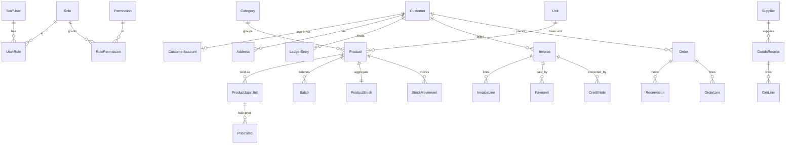

# Data Architecture — Full Schema

**Status:** DRAFT · 2026-06-24
The complete data model (Prisma schema) for every module. This is the doc `03-technical-architecture.md` refers to for "concrete schema". It realizes the patterns in `03` (UoM, atomic stock + reservations, gapless numbering, kacha zero-trace, tax), the RBAC model in `10-rbac.md`, and the security/audit requirements in `07-security-architecture.md`.

> Lives in `packages/db/prisma/schema.prisma`. Phase 3 of `11-scaffolding-plan.md` ships the **foundation** (auth realms + RBAC + audit + UoM core + counters); the remaining domains are grown in the data-model build but are all specified here so the shape is settled up front.

---

## Conventions
- **IDs:** `cuid()` strings (`id String @id @default(cuid())`).
- **Money & quantity:** Prisma **`Decimal`** everywhere — never float (`03 A1`). DB precision: amounts `@db.Decimal(14,2)`, quantities `@db.Decimal(14,3)`, conversion factors / tax rates `@db.Decimal(18,6)` / `@db.Decimal(5,2)`. Money crosses the API as integer **paise**; `Decimal` is serialized via superjson inside server actions.
- **Timestamps:** `createdAt DateTime @default(now())`, `updatedAt DateTime @updatedAt` where mutable.
- **No hard deletes of financial records:** invoices/credit-notes/ledger are **cancelled or corrected**, never deleted (`03 §7`, `07 §10`). Catalog uses `isActive`/archive flags.
- **Two auth realms** (`10 §2.3`): `StaffUser` (admin) and `CustomerAccount` (storefront) are **separate** — never one user table.
- **Party vs login:** `Customer` is the **billing/khata party** (may be a walk-in with no login); `CustomerAccount` is the **storefront login** that links to a `Customer`. Counter khata customers exist as `Customer` with no account.
- **Kacha = no table.** A kacha sale persists **only** a `StockMovement{kind: KACHA_OUT}` (`03 §6`); there is deliberately no kacha invoice/line/value entity.

## ER overview (grouped)


---

## 1. Auth realms (`10 §2.3`, `07 §1`)
Credentials-only at v1; **server-side (database) sessions** with opaque cookies. Each realm has its own user + session + token tables.

```prisma
model StaffUser {
  id            String   @id @default(cuid())
  email         String   @unique
  passwordHash  String
  name          String
  status        String   @default("ACTIVE")     // ACTIVE | DISABLED
  emailVerified DateTime?
  roles         UserRole[]
  sessions      StaffSession[]
  totp          StaffTotp?
  createdAt     DateTime @default(now())
  updatedAt     DateTime @updatedAt
}

model StaffSession {
  id          String   @id @default(cuid())
  staffUserId String
  staffUser   StaffUser @relation(fields: [staffUserId], references: [id], onDelete: Cascade)
  expiresAt   DateTime
  createdAt   DateTime @default(now())
  @@index([staffUserId])
}

model StaffTotp {
  staffUserId   String   @id
  staffUser     StaffUser @relation(fields: [staffUserId], references: [id], onDelete: Cascade)
  secretEnc     String                          // encrypted at rest
  recoveryCodes String[]                         // hashed
  enabled       Boolean  @default(false)         // scaffolded, off in v1
}

model CustomerAccount {
  id            String   @id @default(cuid())
  customerId    String   @unique
  customer      Customer @relation(fields: [customerId], references: [id])
  email         String   @unique
  passwordHash  String
  emailVerified DateTime?
  sessions      CustomerSession[]
  createdAt     DateTime @default(now())
}

model CustomerSession {
  id         String   @id @default(cuid())
  accountId  String
  account    CustomerAccount @relation(fields: [accountId], references: [id], onDelete: Cascade)
  expiresAt  DateTime
  createdAt  DateTime @default(now())
  @@index([accountId])
}

model VerificationToken {          // email verify + password reset, both realms
  id         String   @id @default(cuid())
  realm      String                            // STAFF | CUSTOMER
  subjectId  String                            // staffUserId or customerAccountId
  purpose    String                            // EMAIL_VERIFY | PASSWORD_RESET
  tokenHash  String   @unique                  // hashed token, never plaintext
  expiresAt  DateTime
  usedAt     DateTime?
  createdAt  DateTime @default(now())
  @@index([subjectId, purpose])
}
```

## 2. RBAC (`10 §3`)
Permission-based; role→permission mapping is **data**, so new roles are inserts, not migrations.

```prisma
model Permission {
  id    String @id @default(cuid())
  key   String @unique                          // e.g. "bill.pakka.create"
  roles RolePermission[]
}
model Role {
  id          String @id @default(cuid())
  key         String @unique                    // OWNER | (future) CASHIER…
  label       String
  permissions RolePermission[]
  users       UserRole[]
}
model RolePermission {
  roleId       String
  permissionId String
  role         Role       @relation(fields: [roleId], references: [id], onDelete: Cascade)
  permission   Permission @relation(fields: [permissionId], references: [id], onDelete: Cascade)
  @@id([roleId, permissionId])
}
model UserRole {
  staffUserId String
  roleId      String
  staffUser   StaffUser @relation(fields: [staffUserId], references: [id], onDelete: Cascade)
  role        Role      @relation(fields: [roleId], references: [id], onDelete: Cascade)
  @@id([staffUserId, roleId])
}
```

## 3. Audit log (`07 §10`, `10 §7`)
Append-only; written inside the same transaction as the audited action.

```prisma
model AuditLog {
  id             String   @id @default(cuid())
  actorStaffId   String?                          // null for system/cron
  roleAtTime     String?
  permissionUsed String?
  action         String                           // "bill.cancel", "stock.adjust"…
  targetType     String?
  targetId       String?
  before         Json?
  after          Json?
  requestId      String?
  createdAt      DateTime @default(now())
  @@index([action, createdAt])
  @@index([targetType, targetId])
}
```

## 4. Catalog & Unit-of-Measure (`03 §4`)
The core. One **base unit** per product; one or more **sale units** with a `factorToBase` and their own price; **quantity-break** slabs on the sale unit.

```prisma
enum UnitKind { MEASURED  PIECE }       // MEASURED → decimals ok; PIECE → whole only

model Category {
  id       String     @id @default(cuid())
  name     String
  parentId String?
  parent   Category?  @relation("Sub", fields: [parentId], references: [id])
  children Category[] @relation("Sub")
  products Product[]
}

model Brand { id String @id @default(cuid())  name String @unique  products Product[] }

model Unit {
  id    String   @id @default(cuid())
  code  String   @unique                 // "m","coil","L","bucket","pc","box","kg","bag"
  name  String
  kind  UnitKind
  baseProducts Product[]        @relation("BaseUnit")
  saleUnits    ProductSaleUnit[]
}

model Product {
  id              String   @id @default(cuid())
  sku             String   @unique
  name            String
  brandId         String?
  brand           Brand?    @relation(fields: [brandId], references: [id])
  categoryId      String
  category        Category  @relation(fields: [categoryId], references: [id])
  hsnCode         String?
  baseUnitId      String
  baseUnit        Unit      @relation("BaseUnit", fields: [baseUnitId], references: [id])
  costPerBaseUnit Decimal   @db.Decimal(14,2)
  gstRate         Decimal   @db.Decimal(5,2)          // %
  priceInclusive  Boolean   @default(false)           // MRP-inclusive back-calc if true
  imageKeys       String[]                            // R2 object keys
  reorderLevel    Decimal?  @db.Decimal(14,3)
  trackExpiry     Boolean   @default(false)
  allowNegative   Boolean   @default(false)           // negative-stock opt-in (03 §5)
  availableOnline Boolean   @default(true)
  isActive        Boolean   @default(true)
  saleUnits       ProductSaleUnit[]
  batches         Batch[]
  stock           ProductStock?
  movements       StockMovement[]
  createdAt       DateTime @default(now())
  updatedAt       DateTime @updatedAt
  @@index([categoryId])
}

model ProductSaleUnit {
  id           String  @id @default(cuid())
  productId    String
  product      Product @relation(fields: [productId], references: [id], onDelete: Cascade)
  unitId       String
  unit         Unit    @relation(fields: [unitId], references: [id])
  factorToBase Decimal @db.Decimal(18,6)             // baseQty = saleQty × factorToBase
  mrp          Decimal? @db.Decimal(14,2)
  salePrice    Decimal @db.Decimal(14,2)             // default price per sale unit
  isDefault    Boolean @default(false)
  priceSlabs   PriceSlab[]
  @@unique([productId, unitId])
}

model PriceSlab {                                     // quantity-break (bulk) pricing
  id              String @id @default(cuid())
  saleUnitId      String
  saleUnit        ProductSaleUnit @relation(fields: [saleUnitId], references: [id], onDelete: Cascade)
  minQty          Decimal @db.Decimal(14,3)
  pricePerSaleUnit Decimal @db.Decimal(14,2)
  @@index([saleUnitId, minQty])
}

model Batch {                                         // batch + optional expiry / MRP-wise
  id        String   @id @default(cuid())
  productId String
  product   Product  @relation(fields: [productId], references: [id], onDelete: Cascade)
  code      String
  mrp       Decimal? @db.Decimal(14,2)
  mfgDate   DateTime?
  expiryDate DateTime?
  onHand    Decimal  @db.Decimal(14,3) @default(0)   // base units, for FIFO/expiry
  @@unique([productId, code])
  @@index([expiryDate])
}
```

## 5. Inventory — stock, movements, reservations (`03 §5`)
`ProductStock` is the **authoritative aggregate** (`available = onHand − reserved`). Movements are the audit trail; batch on-hand is maintained in parallel for expiry/FIFO.

```prisma
enum MovementKind {
  GRN_IN  SALE_OUT  KACHA_OUT  ADJUST_IN  ADJUST_OUT
  SALES_RETURN_IN  PURCHASE_RETURN_OUT  ORDER_DISPATCH_OUT
}
enum ReservationStatus { ACTIVE  RELEASED  CONVERTED  EXPIRED }

model ProductStock {
  productId String  @id
  product   Product @relation(fields: [productId], references: [id], onDelete: Cascade)
  onHand    Decimal @db.Decimal(14,3) @default(0)    // base units
  reserved  Decimal @db.Decimal(14,3) @default(0)
  updatedAt DateTime @updatedAt
}

model StockMovement {
  id          String   @id @default(cuid())
  productId   String
  product     Product  @relation(fields: [productId], references: [id])
  batchId     String?
  baseQty     Decimal  @db.Decimal(14,3)             // signed: + in, − out
  kind        MovementKind
  refType     String?                                // INVOICE | GRN | ORDER | ADJUSTMENT | CN
  refId       String?
  reason      String?                                // for adjustments
  actorStaffId String?
  createdAt   DateTime @default(now())
  @@index([productId, createdAt])
  @@index([kind])
}

model Reservation {
  id        String   @id @default(cuid())
  orderId   String
  order     Order    @relation(fields: [orderId], references: [id], onDelete: Cascade)
  productId String
  baseQty   Decimal  @db.Decimal(14,3)
  status    ReservationStatus @default(ACTIVE)
  expiresAt DateTime
  createdAt DateTime @default(now())
  @@index([status, expiresAt])
  @@index([productId])
}
```

## 6. Suppliers & purchasing
GRN increases stock; supplier payables are optional ([N]).

```prisma
model Supplier {
  id        String   @id @default(cuid())
  name      String
  gstin     String?
  phone     String?
  address   String?
  receipts  GoodsReceipt[]
  payments  SupplierPayment[]
  createdAt DateTime @default(now())
}
model GoodsReceipt {                                  // GRN
  id         String   @id @default(cuid())
  supplierId String?
  supplier   Supplier? @relation(fields: [supplierId], references: [id])
  refNo      String?
  date       DateTime @default(now())
  note       String?
  lines      GrnLine[]
  createdById String?
}
model GrnLine {
  id        String   @id @default(cuid())
  grnId     String
  grn       GoodsReceipt @relation(fields: [grnId], references: [id], onDelete: Cascade)
  productId String
  batchId   String?
  baseQty   Decimal  @db.Decimal(14,3)
  costPerBaseUnit Decimal @db.Decimal(14,2)
}
model SupplierPayment {                               // payables [N]
  id        String   @id @default(cuid())
  supplierId String
  supplier  Supplier @relation(fields: [supplierId], references: [id])
  amount    Decimal  @db.Decimal(14,2)
  mode      String
  date      DateTime @default(now())
}
```

## 7. Parties & khata ledger
`Customer` = billing/credit party (counter or online). `LedgerEntry` = the khata.

```prisma
enum CustomerType { RETAIL  WHOLESALE }
enum LedgerEntryType { INVOICE_DEBIT  PAYMENT_CREDIT  CREDIT_NOTE_CREDIT  OPENING  ADJUSTMENT }

model Customer {
  id          String   @id @default(cuid())
  name        String
  phone       String?
  gstin       String?
  type        CustomerType @default(RETAIL)
  creditLimit Decimal? @db.Decimal(14,2)
  account     CustomerAccount?
  addresses   Address[]
  invoices    Invoice[]
  orders      Order[]
  ledger      LedgerEntry[]
  createdAt   DateTime @default(now())
  @@index([phone])
}
model Address {
  id         String  @id @default(cuid())
  customerId String
  customer   Customer @relation(fields: [customerId], references: [id], onDelete: Cascade)
  line1      String
  line2      String?
  city       String
  state      String                                  // place-of-supply driver (03 §8)
  pincode    String
  isDefault  Boolean @default(false)
}
model LedgerEntry {
  id         String   @id @default(cuid())
  customerId String
  customer   Customer @relation(fields: [customerId], references: [id])
  type       LedgerEntryType
  amount     Decimal  @db.Decimal(14,2)              // + debit / − credit by convention
  refType    String?                                 // INVOICE | PAYMENT | CN
  refId      String?
  note       String?
  createdAt  DateTime @default(now())
  @@index([customerId, createdAt])
}
```

## 8. Billing & GST (`03 §7,§8`)
Pakka only. **Gapless** numbering via per-FY counters; tax split by place of supply; **cancel/credit-note**, never delete.

```prisma
enum InvoiceStatus { ACTIVE  CANCELLED }
enum PaymentMode   { CASH  UPI  CARD  CREDIT }

model InvoiceCounter { fy String @id   lastNo Int @default(0) }   // 03 §7
model CreditNoteCounter { fy String @id   lastNo Int @default(0) } // own gapless series

model Invoice {
  id                String   @id @default(cuid())
  fy                String                            // "2026-27"
  invoiceNo         String                            // "2026-27/000124"
  customerId        String?
  customer          Customer? @relation(fields: [customerId], references: [id])
  customerNameSnap  String?                           // walk-in / snapshot
  customerGstinSnap String?
  placeOfSupplyState String
  date              DateTime @default(now())
  taxableTotal      Decimal  @db.Decimal(14,2)
  discountTotal     Decimal  @db.Decimal(14,2) @default(0)
  cgstTotal         Decimal  @db.Decimal(14,2) @default(0)
  sgstTotal         Decimal  @db.Decimal(14,2) @default(0)
  igstTotal         Decimal  @db.Decimal(14,2) @default(0)
  roundOff          Decimal  @db.Decimal(14,2) @default(0)
  grandTotal        Decimal  @db.Decimal(14,2)
  status            InvoiceStatus @default(ACTIVE)
  cancelledReason   String?
  orderId           String?  @unique                  // set when generated from an order on dispatch
  createdById       String?
  lines             InvoiceLine[]
  payments          Payment[]
  creditNotes       CreditNote[]
  createdAt         DateTime @default(now())
  @@unique([fy, invoiceNo])                           // gapless backstop (03 §7)
  @@index([customerId])
}

model InvoiceLine {
  id           String  @id @default(cuid())
  invoiceId    String
  invoice      Invoice @relation(fields: [invoiceId], references: [id], onDelete: Cascade)
  productId    String
  saleUnitId   String
  hsnCode      String?
  saleQty      Decimal @db.Decimal(14,3)
  baseQty      Decimal @db.Decimal(14,3)
  unitPrice    Decimal @db.Decimal(14,2)              // may be a manual rate override
  lineDiscount Decimal @db.Decimal(14,2) @default(0)
  taxableValue Decimal @db.Decimal(14,2)              // after discount, before tax (03 §8)
  gstRate      Decimal @db.Decimal(5,2)
  cgst         Decimal @db.Decimal(14,2) @default(0)
  sgst         Decimal @db.Decimal(14,2) @default(0)
  igst         Decimal @db.Decimal(14,2) @default(0)
}

model Payment {
  id         String   @id @default(cuid())
  invoiceId  String?
  invoice    Invoice? @relation(fields: [invoiceId], references: [id])
  orderId    String?
  customerId String?
  mode       PaymentMode
  amount     Decimal  @db.Decimal(14,2)               // part-payment supported (many per invoice)
  reference  String?                                  // UPI/txn ref / Razorpay paymentId
  date       DateTime @default(now())
  @@index([invoiceId])
}

model CreditNote {
  id            String   @id @default(cuid())
  fy            String
  creditNoteNo  String                                // own gapless series
  invoiceId     String
  invoice       Invoice  @relation(fields: [invoiceId], references: [id])
  reason        String?
  taxableTotal  Decimal  @db.Decimal(14,2)
  cgstTotal     Decimal  @db.Decimal(14,2) @default(0)
  sgstTotal     Decimal  @db.Decimal(14,2) @default(0)
  igstTotal     Decimal  @db.Decimal(14,2) @default(0)
  grandTotal    Decimal  @db.Decimal(14,2)
  refundMode    String?                               // CASH | UPI | KHATA_ADJUST | GATEWAY
  lines         CreditNoteLine[]
  createdAt     DateTime @default(now())
  @@unique([fy, creditNoteNo])
}
model CreditNoteLine {
  id           String @id @default(cuid())
  creditNoteId String
  creditNote   CreditNote @relation(fields: [creditNoteId], references: [id], onDelete: Cascade)
  productId    String
  saleUnitId   String
  saleQty      Decimal @db.Decimal(14,3)
  baseQty      Decimal @db.Decimal(14,3)
  taxableValue Decimal @db.Decimal(14,2)
  gstRate      Decimal @db.Decimal(5,2)
}
```

> **Kacha:** intentionally **absent** — no invoice/line/value. A kacha sale writes only `StockMovement{kind: KACHA_OUT}` (`03 §6`).

## 9. Orders & ecommerce (`03 §5,§9`)
Order reserves stock; on dispatch a pakka `Invoice` is generated (one-to-one via `Invoice.orderId`). Razorpay events are deduplicated.

```prisma
enum OrderStatus    { PENDING_PAYMENT  PAY_LATER  CONFIRMED  PACKED  DISPATCHED  COMPLETED  CANCELLED }
enum FulfilmentType { DELIVERY  PICKUP }
enum PaymentStatus  { UNPAID  PARTIAL  PAID  REFUNDED }

model Order {
  id                String   @id @default(cuid())
  orderNo           String   @unique
  customerId        String
  customer          Customer @relation(fields: [customerId], references: [id])
  status            OrderStatus  @default(PENDING_PAYMENT)
  fulfilment        FulfilmentType
  addressId         String?
  placeOfSupplyState String?
  itemTotal         Decimal  @db.Decimal(14,2)
  deliveryFee       Decimal  @db.Decimal(14,2) @default(0)
  grandTotal        Decimal  @db.Decimal(14,2)
  paymentStatus     PaymentStatus @default(UNPAID)
  razorpayOrderId   String?
  reservations      Reservation[]
  lines             OrderLine[]
  createdAt         DateTime @default(now())
  @@index([customerId])
  @@index([status])
}
model OrderLine {
  id         String  @id @default(cuid())
  orderId    String
  order      Order   @relation(fields: [orderId], references: [id], onDelete: Cascade)
  productId  String
  saleUnitId String
  saleQty    Decimal @db.Decimal(14,3)
  baseQty    Decimal @db.Decimal(14,3)
  unitPrice  Decimal @db.Decimal(14,2)
}
model ProcessedWebhook {                              // idempotency (03 §9)
  id        String   @id @default(cuid())
  eventId   String   @unique                          // Razorpay event id
  paymentId String?
  type      String?
  createdAt DateTime @default(now())
}
```

## 10. Store settings (single-store; holds the configurable TBDs)
```prisma
model StoreConfig {
  id                    String  @id @default("default")
  name                  String
  gstin                 String?
  homeState             String                         // intra/inter-state decision (03 §8)
  address               String?
  logoKey               String?
  bankDetails           String?
  invoiceTerms          String?
  invoicePrefixFormat   String  @default("{FY}/{SEQ6}") // 03 §7
  deliveryFlatFee       Decimal @db.Decimal(14,2) @default(0)
  freeDeliveryThreshold Decimal? @db.Decimal(14,2)
  reservationTtlMinutes Int     @default(30)            // 03 A4 (TBD value, now a setting)
  gstRoundingMode       String  @default("PER_INVOICE") // 03 A3 (TBD, now a setting)
}
```

---

## Indexes & constraints (beyond the inline ones)
- **Search (`03 §11`):** a migration adds **GIN `pg_trgm`** indexes on `Product.name`, `Product.sku`, `Brand.name` for typeahead/fuzzy; barcode lookups use the unique `Product.sku`.
- **Gapless numbering:** `@@unique([fy, invoiceNo])` and `@@unique([fy, creditNoteNo])` back the counter logic in `03 §7`.
- **Idempotency:** `ProcessedWebhook.eventId @unique` (`03 §9`).
- **Stock integrity:** the atomic `UPDATE … WHERE onHand − reserved >= qty` (`03 §5`) runs against `ProductStock`; movements are the trail.

## Reports / GSTR-1 (derived, not stored)
GSTR-1 (B2B, B2C, HSN summary) and day-end roll-ups are **queries/views over `Invoice` + `InvoiceLine` (+ `CreditNote`)**, not new tables. A later materialized view can cache them; **kacha is excluded by design** (no rows exist).

## Phase-3 foundation vs grown later
- **Phase 3 (initial migration):** auth realms, RBAC, AuditLog, VerificationToken, Unit, Category, Brand, Product, ProductSaleUnit, ProductStock, StockMovement, InvoiceCounter, StoreConfig.
- **Grown next (data-model build):** PriceSlab, Batch, Reservation, Supplier/GRN, Customer/Address/LedgerEntry, Invoice/Line/Payment/CreditNote, Order/OrderLine, ProcessedWebhook.

## Open items (TBD)
- **Decimal scale** finalisation (qty 3dp proposed; confirm for loose weight).
- **Credit-note series** = its own gapless sequence (decided here; confirm with accountant).
- **GST rounding** PER_INVOICE vs PER_LINE — now a `StoreConfig` toggle (`03 A3`).
- **Batch vs aggregate stock** reconciliation job (keep `Batch.onHand` and `ProductStock.onHand` consistent).
- **Variants** (size/colour/gauge) — modelled later as a `ProductVariant` child or via attributes ([N] in the proposal).
- **Delivery challan / saved quotation** ([N]) — add `DeliveryChallan` / `Quotation` tables when those features are scheduled.
